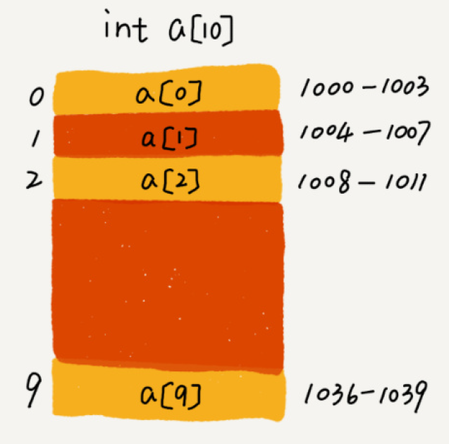

数组 Array 是一种**线性**表数据结构。**连续内存**空间，来存储一组具有**相同类型**的数据。

线性：数据排列成线状，只有前后两个方向。





数组支持**随机访问** :smile: **根据下标/索引的随机访问时间复杂度 O(1)**

```bash
# addressing
a[i]_addr = base_addr + i * data_type_size
```

:cry: 插入

- 末尾：O(1)
- 头部
  - 最坏：O(N) 所有元素都要依次往后移动
  - 平均：O(N) ← 插入位置的概率是一样的 1/n ← $$1*1/n+2*1/n+3*1/n+...n*1/n$$
- 对于无序数组：只要将第 k 位的移动到最后，将新元素插入到第 k 位。

:cry: 删除

- 末尾：O(1)
- 头部
  - 最坏：O(N) 所有元素都要依次往前移动
  - 平均：O(N) ← 删除位置的概率是一样的 1/n ← $$1*1/n+2*1/n+3*1/n+...n*1/n$$
- 可以将**多次删除合并**提高效率，每次删除只是记录，当 commit 时候才会真正进行操作。
  - JVM GC：从根对象遍历标记，到最后再一并清除。


**数组越界** IndexOutOfBounds 即访问到了不属于数组的内存地址上。


> 为什么下标/索引从 0 开始？

∵ base_addr的原因，如果从 1 开始的话，每次访问都要进行一次减法运算。

```bash
a[k]_address = base_address + (k-1)*type_size
```

