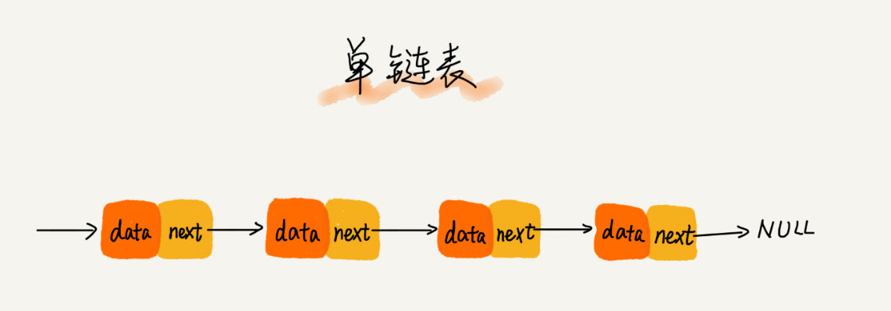
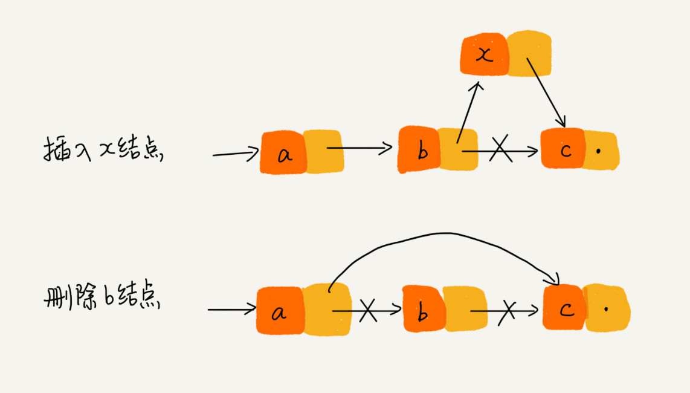
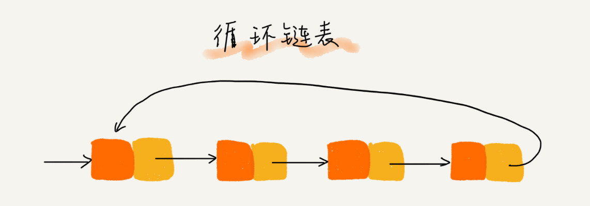
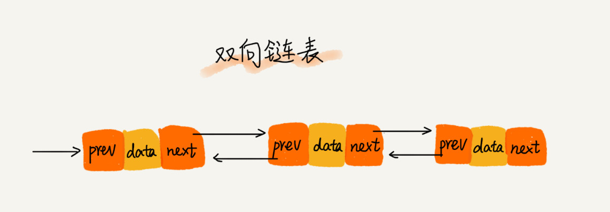
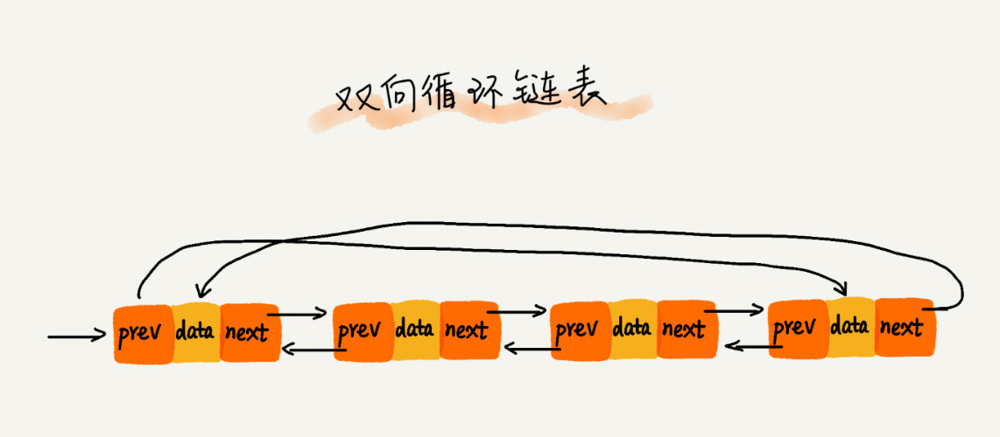

链表**非连续内存**，通过**指针**将零散的内存块**串联**起来，内存块表示为节点 node。

**单链表**：head(base_addr), tail(→ nil)

- :smile: 插入/删除：O(1) 只需要改变相邻结点的指针指向。
- :cry: 查询：O(n) 只能一个接着一个找。

**循环链表**：tail(→ head) 解决[约瑟夫问题](https://zh.wikipedia.org/wiki/%E7%BA%A6%E7%91%9F%E5%A4%AB%E6%96%AF%E9%97%AE%E9%A2%98)

**双向链表**：prev + next (→ prev of nxt node) 额外空间保存指针信息 → 典型：空间换时间。

- 删除：需要知道前一个节点的地址，修改指向要删除节点的下一个节点。
  - <u>给定值</u>的节点：单纯操作 O(1)，但遍历要 O(n)
  - <u>给定指针</u>的节点：节点自带 prev，O(1)
- 插入：同理，节点自带 prev，修改前一个节点指向自身，将自身指向下一个节点，同时像一个节点回指。O(1)

**缓存**是一种提高数据读取性能的技术，常见于 CPU/DB/Browser。

缓存策略：FIFO, LFU 最少使用, **LRU 最近最少使用**

实现：单链表即可

1. 如果数据存在链表中，遍历获取节点，将其插入到 head。
2. 如果数据没有在其中
   - 缓存未满：直接插入到 head
   - 缓存已满：删除 tail，插入到 head。

#### :construction_worker: **Practice**

