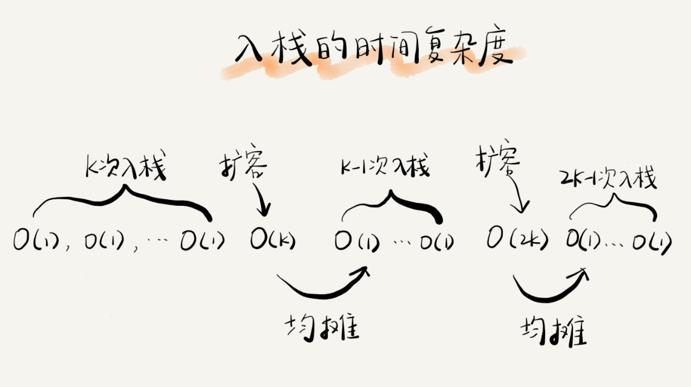
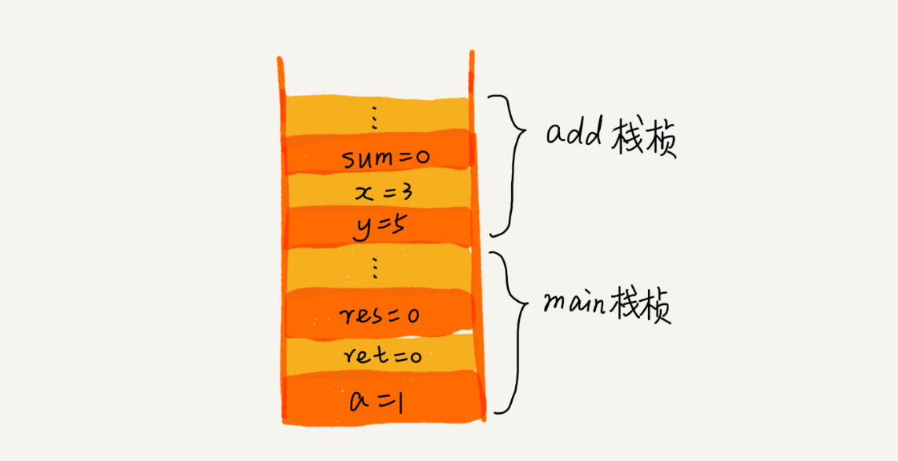
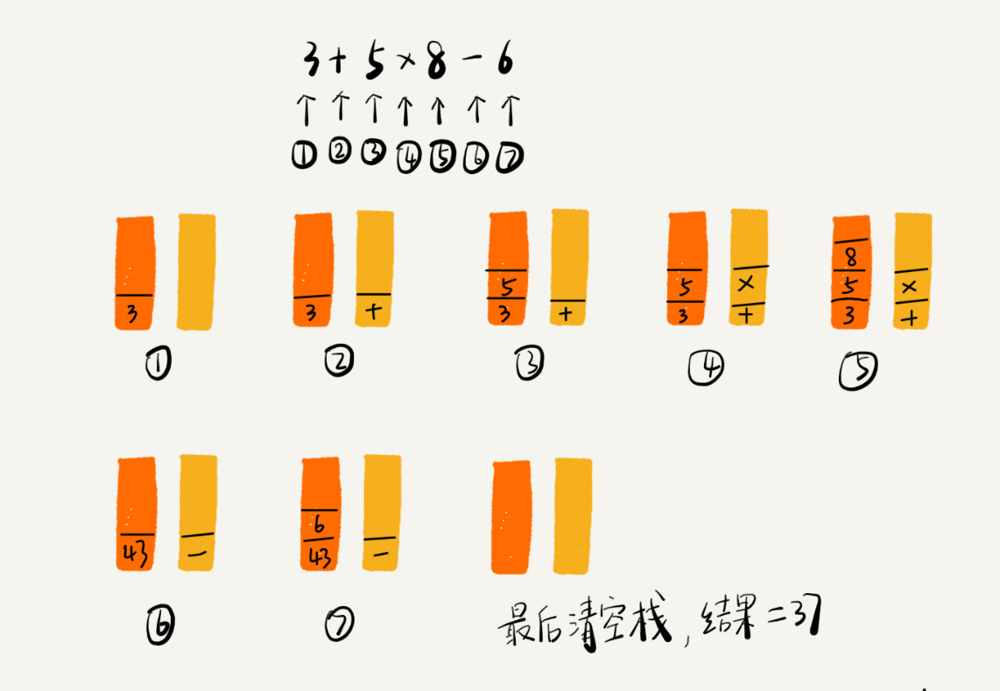

Stack FILO 栈是一种“操作受限”的线性表，**只允许一端进行插入/删除操作**。

时间复杂度：入栈/出栈 Push/Pop O(1)

栈既可以用**数组（顺序栈）**来实现。

- 通过 top 数组下标控制。

也可以用**链表（链式栈）**来实现。

- “自上而下”：入栈创建一个节点，next 指向 top，并更新 top 为新创建的节点；出栈先获取 top 的值，然后将 top 更新为 top.next。

**动态扩容**：类比数组 → 申请更大的空间，将原数组数据拷贝。

时间复杂度：

- 入栈 O(1)~O(n) 平均：O(1) → 摊还 → 第 K 次入栈触发扩容迁移 K 个数据，也就是就 K 个数据均摊都 K 次入栈操作。
  - 均摊时间复杂度一般都等于最好情况时间复杂度
- 出栈 O(1)

**函数调用**：每进入函数，就将临时变量作为一个栈入栈，当函数执行完成返回之后，将对应的栈帧出栈。

**表达式求值**：编译器就是通过两个栈来实现的。

- 栈#1：保存操作数。
- 栈#2：保存运算符。

从左向右遍历表达式

- 当遇到数字，我们就直接压入操作数栈。

- 当遇到运算符，就与运算符栈的栈顶元素进行比较。

  - 如果比运算符栈顶元素的优先级高，就将当前运算符压入栈；

  - 如果比运算符栈顶元素的优先级低或者相同，从运算符栈中取栈顶运算符，从操作数栈的栈顶取 2 个操作数，然后进行计算，再把计算完的结果压入操作数栈，继续比较。

    

**浏览器页面前进/后退**：用 2 个栈实现

- 栈#1：保存前进页面。（用户视图）
- 栈#2：保存后退页面。