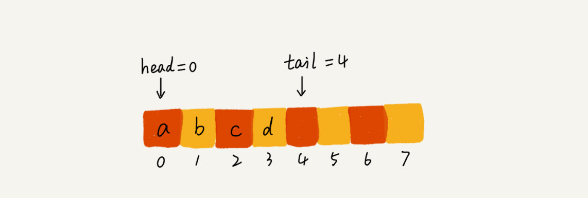
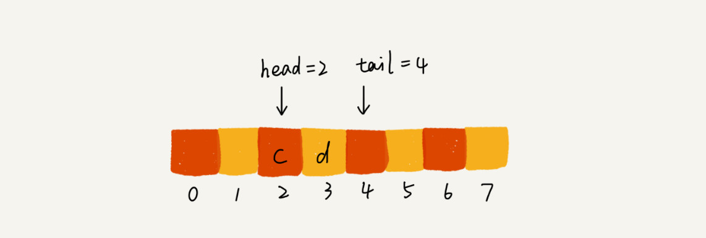
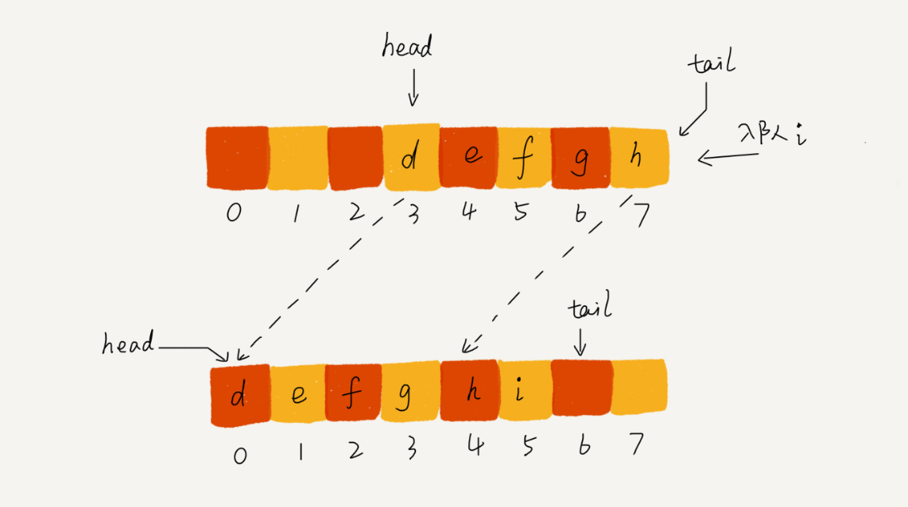
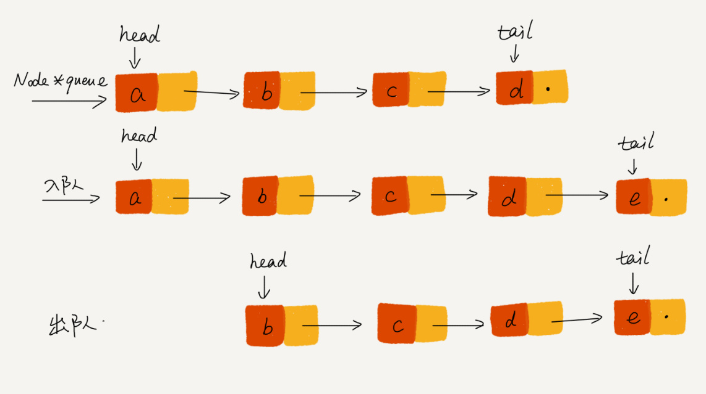
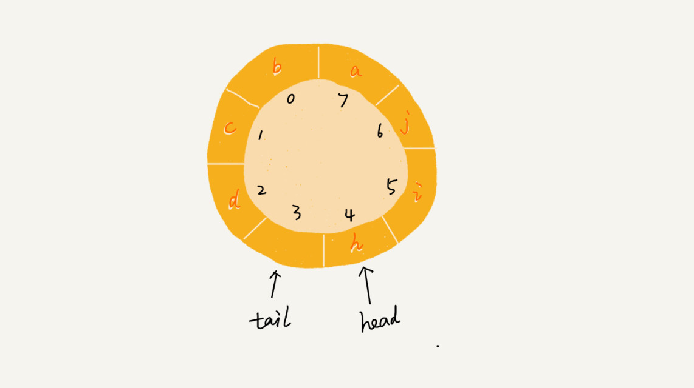
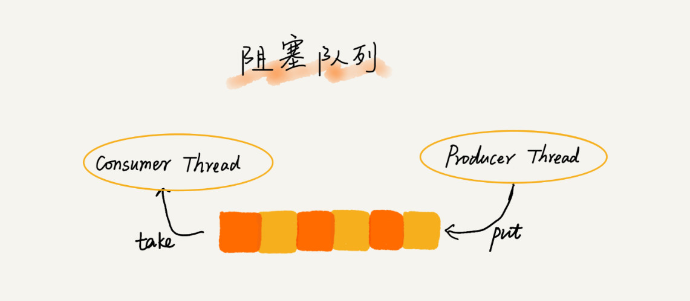
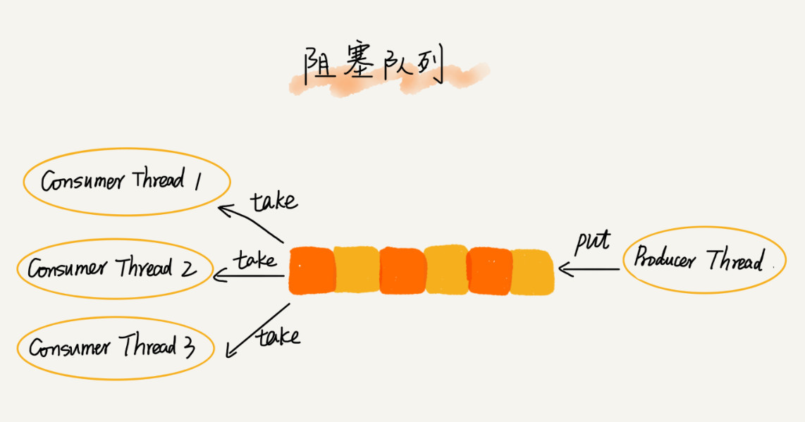

Queue FIFO 队列也是一种“操作受限”的线性表，**只允许一端进行插入，另一端进行弹出**。

队列可以用**数组（顺序队列）**来实现。

- **队头 head++ → 出队 dequeue；队尾 tail++ → 入队 enqueue**
- 随着不断操作，head/tail 都会持续后移，到达边界无法继续入队。
  - 当数组满的时候，在入队的时候进行数据迁移 head~tail → 0~(head-tail)

队列也可以用**链表（链式队列）**来实现，同样需要队头 head & 队尾 tail 两个指针。

**循环队列**：关键在于确定边界条件

- 空队列：head == tail
- 满队列：(tail+1)%cap == head
- 入队：(tail + 1) % cap
- 出队：(head + 1) % cap

**阻塞队列**：队列为空时阻塞出队；队列满时阻塞入队 → 生产/消费模型

**并发队列**：多消费者的阻塞队列。

> 线程池没有空闲线程时 = 资源紧张，新的任务请求线程资源时，线程池该如何处理？各种处理策略又是如何实现的呢？

1. 非阻塞：直接拒绝
2. 阻塞：请求排队，等到有空闲线程再从队列中取出执行。

基于**数组**实现：边界，满了直接拒绝，适合时间敏感。

基于**链表**实现：无边界，可能会造成过多请求等待，最终饿死。

