### Overview

| Alg                  | Time Complexity | If compare |
| -------------------- | --------------- | ---------- |
| Bubble/Insert/Select | O(n^2)          | √          |
| Quick/Merge          | O(n*logn)       | √          |
| Bucket/Counter/Base  | O(n)            | ×          |

**分析排序算法**

**效率**：

1. Best/Wrost/Ave 时间复杂度；且需要直到在不同数据下（接近有序/完全无序）的性能表现。
2. 系数、常数、低阶。
3. 比较次数 & 交换次数。

**内存消耗**：Sorted in place 原地排序，即空间复杂度 O(1)。

**稳定性**：同值多元素排序前后的相对位置没有改变。

- UC：电商订单 → 先按下单时间排序；然后再按金额用稳定排序 → 相同金额仍保持下单时间的先后。

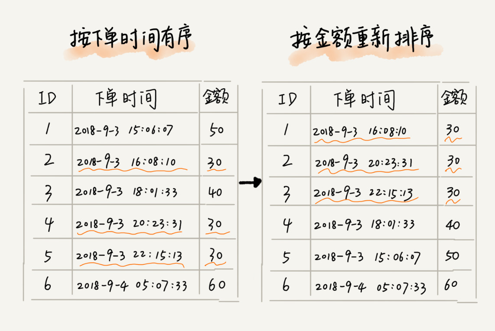

### Bubble

思路：**每次冒泡操作都会对相邻的两个元素进行比较，看是否满足大小关系要求。如果不满足就让它俩互换。**

每次冒泡会让至少一个元素移动到它应该在的位置，重复 n 次。（外循环）

每次冒泡就有一个元素加入完全有序的序列，这时只需要对前/后未排序的元素进行冒泡即可。（内循环）

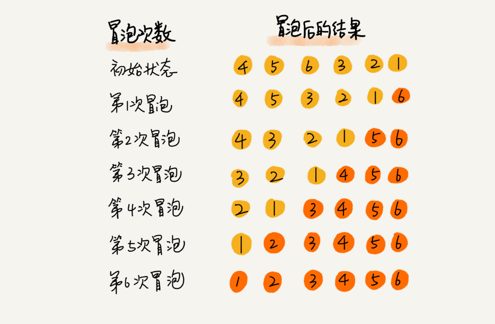

:confused: **In place?** 相邻数据交换，没有开辟新空间。

:confused: **Stable?** 同值排序前后不会改变顺序。

:confused: **Big O?** 

- 最好 O(n)　完全有序，但还是要从头到位比较判断一轮。
- 最坏 O(n^2) 完全逆序。
- 平均：O(n^2) 

### Insertion

:confused: **对于有序数组，添加数据如何确保其有序？**遍历并找到应该插入的位置即可。

Split：**已排序**（初始只有一个元素，即数组第一个元素 ＝ 从第二个开始）& **未排序**（剩余元素）。

思路：**取未排序中的元素，在已排序中找到合适的插入位置将其插入，并保证已排序数据一直有序。**先比较找到位置，然后将其后的元素后移一位腾出位置。

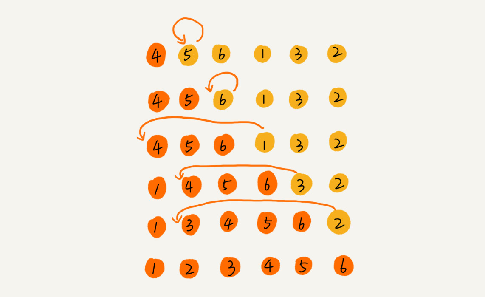

:confused: **In place?** 数据移动，没有开辟新空间。

:confused: **Stable?** 同值排序前后不会改变顺序。（插入到其后）

:confused: **Big O?** 

- 最好 O(n) 完全有序，但还是要从头到位比较判断一轮。
- 最坏 O(n^2) 完全逆序，每次插入已排序的第一个位置，然后移动。
- 平均：O(n^2) 在数组中插入一个数据的平均时间复杂度 O(n)，要插入 n 次。

### Selection

类 Insertion，分已排序 & 未排序。

思路：**每次会从未排序中找到最小的元素，与已排序的末尾进行交换。**

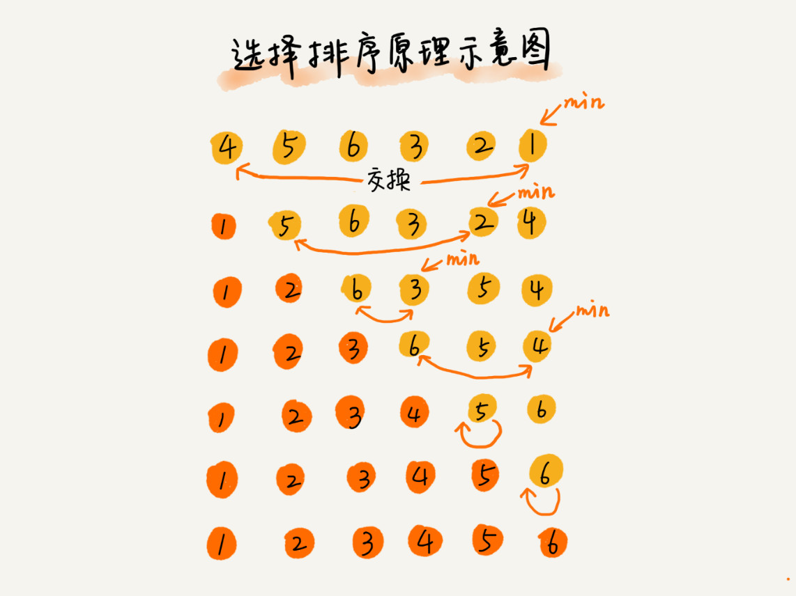

:confused: **In place?** 数据交换，没有开辟新空间。

:confused: **Stable?** 不稳定，min 和 前面元素交换。

:confused: **Big O?** 

- 最好 O(n^2) 
- 最坏 O(n^2) 
- 平均：O(n^2) 

### Summary#1 :bookmark_tabs:

> Why Insertion better than Bubble?

冒泡排序的数据交换要比插入排序的数据移动要复杂。

冒泡排序需要 3 个赋值操作（数据交换），而插入排序只需要 1 个（数据移动）。

实际开发中应用并不多，但是**插入排序**还是挺有用的。

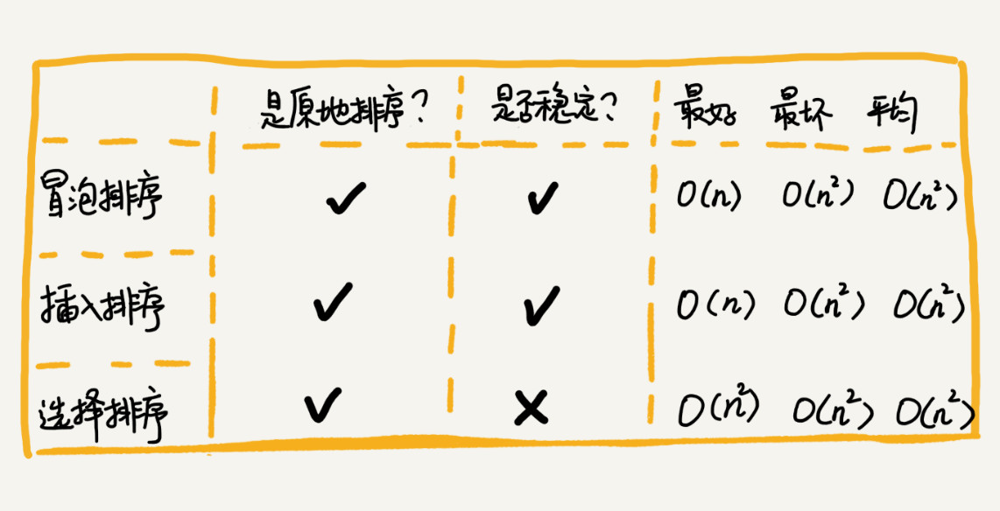

### Merge

分治法：**把数组从中间分成前后两部分，然后分别排序，再将排好序的两部分合并在一起。**

- 分解：递归 [0...n-1] → [0, n/2] + [(n+1)/2, n-1]
  - Base case: 数组大小 1 or 2 的时候
- 合并：临时数组 + 双指针移动比较（同有序链表合并）

实现：

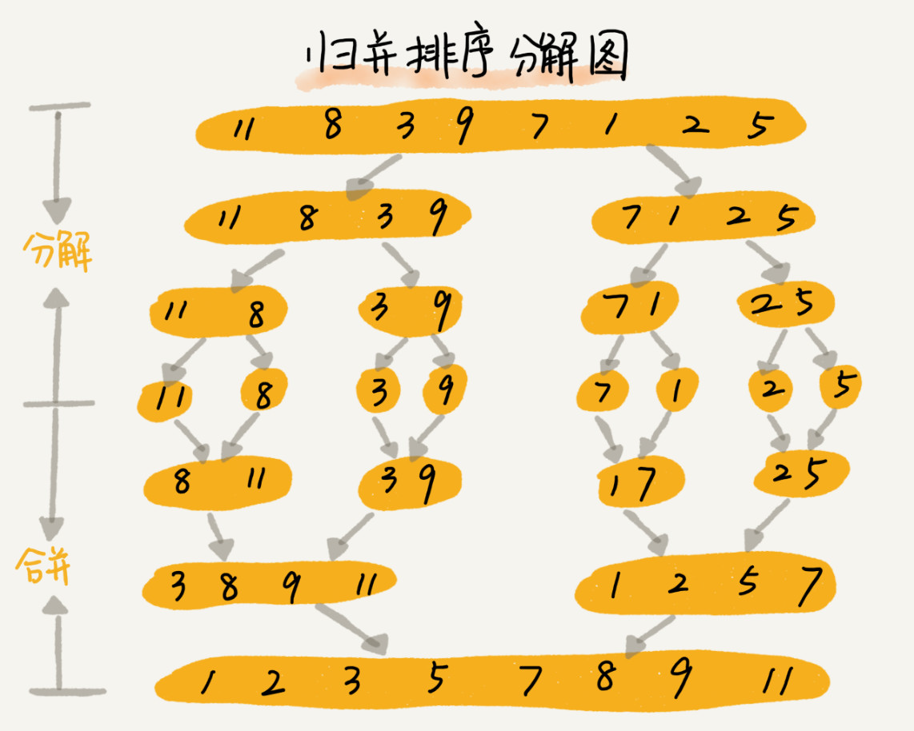

:confused: **In place?** 合并需开辟新空间。

:confused: **Stable?** 关键在于 merge，比较可以保证相对顺序不变。

:confused: **Big O?** 

- 最好 O(nlogn) → 分解 O(logn) * 合并 O(n)
- 最坏 O(nlogn)
- 平均：O(nlogn)

### Quick

思路：**选择一个 pivot，然后遍历，将小于 pivot 的放到左边，将大于 pivot 的放到右边**

- 分区函数 partition：确定 pivot（一般最后一个）
- 合并：< pivot + piviot + > pivot
- Base case: 数组大小 1 or 2 的时候

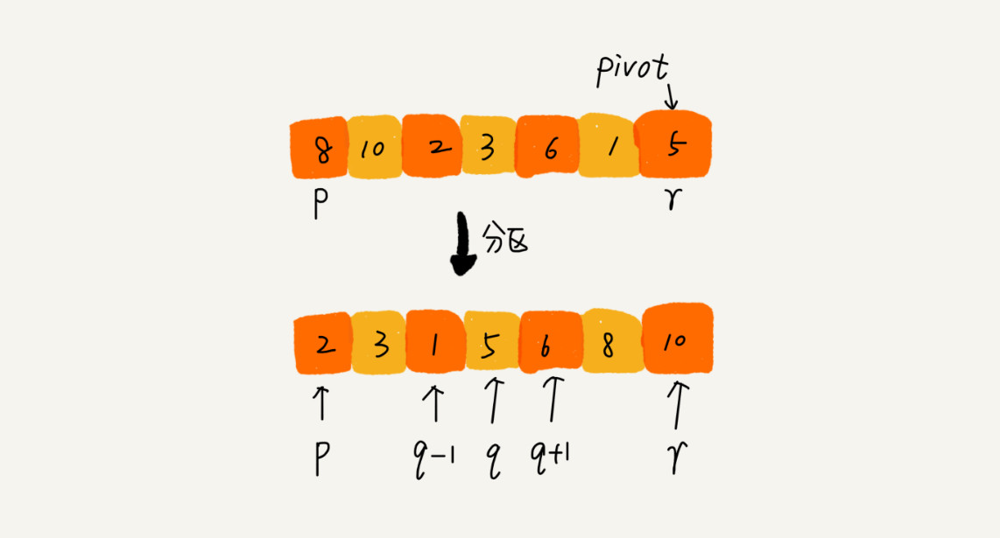

**In-place 优化**：在确定 pivot 过程中同时完成分区 [p...i-1] & [i...r-1]

- i 是小于 pivot 的最后一个元素的索引。
- 遍历如果当前元素小于或等于 pivot 元素，就交换 i & j，并 i++
- 最终遍历完，pivot 和 i 进行交换，这样实现了 pivot 左小右大。

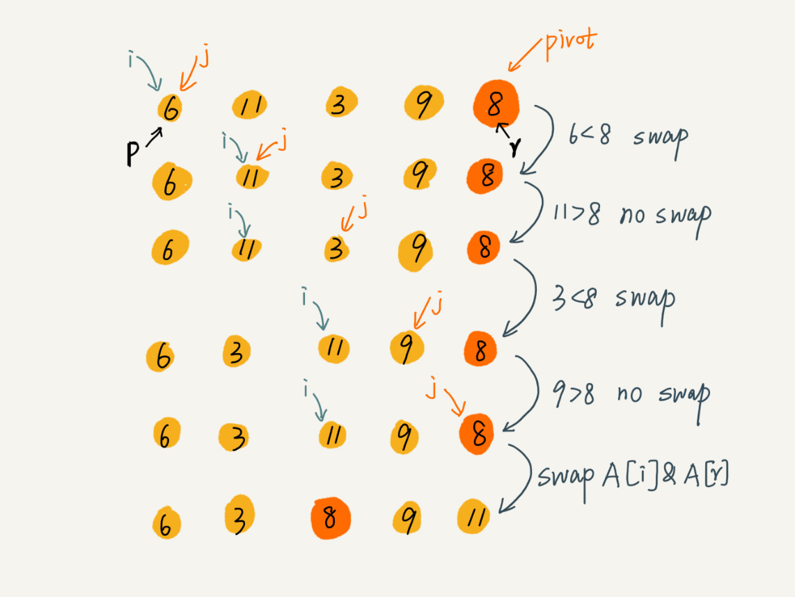

:confused: **In place?** Yes.

:confused: **Stable?** 不稳定，分区操作可能会将相等的元素交换到基准的一侧，从而改变它们原有的相对顺序。

:confused: **Big O?** 

- 最好 O(nlogn)
- 最坏 O(n^2)
- 平均：O(nlogn)

### Summary#2 :bookmark_tabs:

Merge: 自下而上，先处理子问题，再合并。

Quick: 自上而下，先分区，再处理子问题。

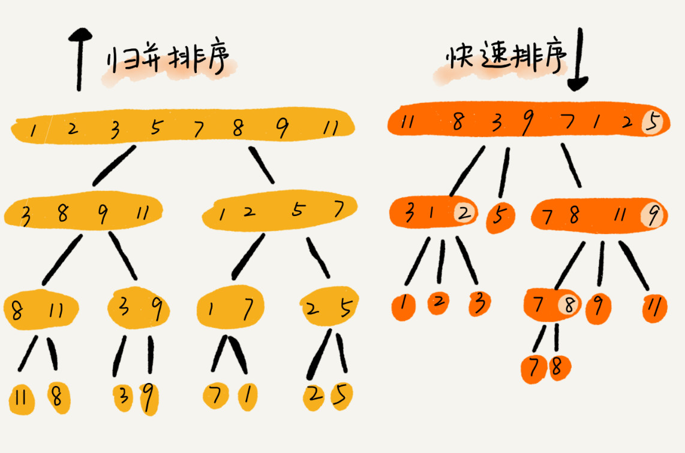

### Bucket

将要排序的数据分到几个有序的桶里，每个桶里的数据再单独进行<u>快速排序</u>。

桶内排完序之后，再把每个桶里的数据按照顺序依次取出，组成的序列就是有序的了。

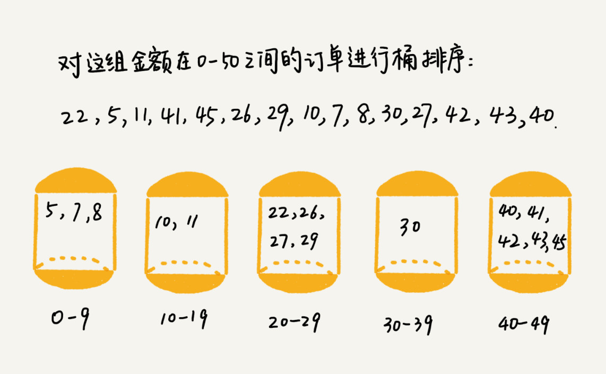

:confused: **Big O?** 

- 最好 O(n)
- 最坏 O(nlogn ~ n^2) 都分到同一个桶中。
- 平均：O(n)

局限

- 数据需要很容易就能划分成 m 个桶；桶间需要有天然大小顺序。这样内部排序完外部就不需要排序了。
- 分布是否平均有影响。

UC：适合**外部排序** = 数据在外部磁盘，内存优先无法全部加载到内存中。

> 我们有 10GB 的订单数据，我们希望按订单金额进行排序，但内存有限，只有几百 MB，没办法一次性把 10GB 的数据都加载到内存中？

理想的情况下，如果订单金额在 1 到 10 万之间均匀分布，那订单会被均匀划分到 100 个文件中，每个小文件中存储大约 100MB 的订单数据，我们就可以将这 100 个小文件依次放到内存中，用快排来排序。等所有文件都排好序之后，我们只需要按照文件编号，从小到大依次读取每个小文件中的订单数据，并将其写入到一个文件中，那这个文件中存储的就是按照金额从小到大排序的订单数据了。

### Counting (TODO)

特殊桶排序。仅限于数据范围不大。

比如最大值是 k，就可以把数据划分成 k 个桶。每个桶内的数据值都是相同的，省掉了桶内排序时间。

> 如果你所在的省有 50 万考生，如何通过成绩快速排序得出名次呢？

分数范围 0-700，可以分成 701 个桶。从头遍历，每个桶进行计数；最终按桶的计数输出桶的值。

### Radix (TODO)

> 假设我们有 10 万个手机号码，希望将这 10 万个手机号码从小到大排序？

### Optimization

小规模：O(n^n)；大规模：O(nlogn)

Merge 虽然时间复杂度都是 O(nlogn)，但不是 in-place，需要额外的空间。

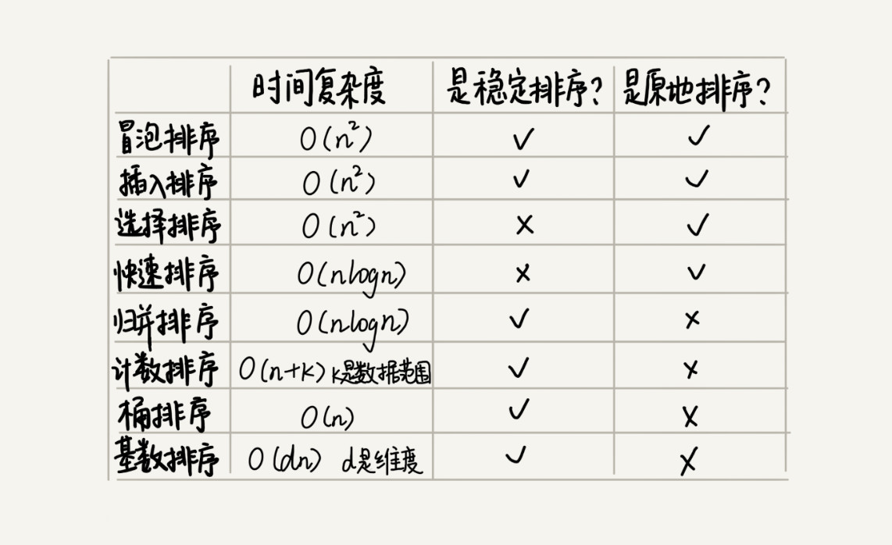

:confused: **如何优化快速排序？**避免 O(n^n)，关键在于选择 pivot

1. 中位数（头/尾/中间）
2. 随机