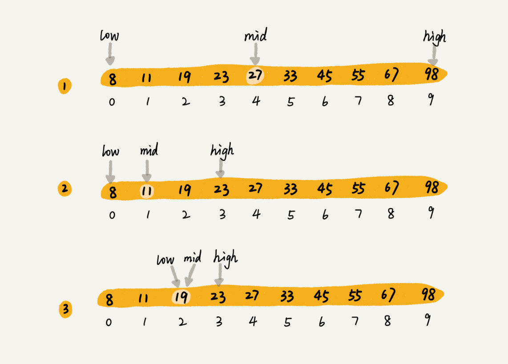

二分查找 Binary Search 每次都与区间的中间数据比对大小，缩小查找区间的范围。时间复杂度 O(logn)

**简单：有序数组中不存在重复元素**

- 如果小于 mid，更新 high = mid-1；如果大于 mid，更新 low = mid+1；等于 mid，返回 a[mid]

- 循环退出条件：low <= high

- mid = low+((high-low)>>1) 避免溢出 + 位运算 ↑

  

**递归：**

- Base case: a[mid] == value
- bsearch(mid+1, high) & bsearch(low, mid-1)

**局限：**

- 仅限顺序表/数组数据结构；链表对通过下标的随机访问不友好，需要 O(n)。
- 数组必须是有序，否则要先进行排序。对于动态变化（插入/删除）的数据集合，二分（要排序嘛）不友好，得使用树。
- 数据量太小（优势体现不出来）/太大（数组容不下）都不合适。

> 如何在 1000 万个整数中快速查找某个整数？

内存限制是 100MB，每个数据大小是 8 字节，直接存数组中.

80MB = 8 * 10,000,000，直接二分查找即可。$$k=log2(10,000,000)=24$$ 

- log₂(10,000,000) = log₁₀(10,000,000) / log₁₀(2)
  - log₁₀(10,000,000) ≈ 7
  - log₁₀(2) ≈ 0.301

### Variants

- 查找**第一个值等于给定值**的元素位置 First
  - a[mid] = v 时，**需要确认一下 a[mid] 是不是第一个**值等于给定值的元素
  - 判断后一个元素 a[mid-1] 是否等于 val，如果不等，那么 mid 就是第一个；否则 high = mid-1

- 查找**最后一个值等于给定值**的元素位置 Last
  - a[mid] = v 时，**需要确认一下 a[mid] 是不是最后一个**值等于给定值的元素
  - 判断后一个元素 a[mid+1] 是否等于 val，如果不等，那么 mid 就是最后一个；否则 low = mid+1

- 查找**第一个大于等于给定值**的元素位置 FirstGT
  - 如果 a[mid] 小于 val，那要查找的值肯定在 [mid+1, high] 之间，low = mid + 1
  - 如果 a[mid] 大于 val，要判断是否为第一个大于 val；即判断 a[mid-1] 是否还大于 val，如果是，则 high = mid - 1 (往左缩小范围)
- 查找**最后一个小于等于给定值**的元素位置 LastLT
  - 如果 a[mid] 大于 val，那要查找的值肯定在 [low, mid-1] 之间，high = mid - 1
  - 如果 a[mid] 小于 val，要判断是否为第一个小于 val；即判断 a[mid+1] 是否还小于 val，如果 low = mid + 1 (往→缩小范围)

> 有 12 万条这样的 IP 区间与归属地的对应关系，如何快速定位出一个 IP 地址的归属地呢？

先将 IP 转换成 32 位数整型，让其按照起始 IP 从小到大排序。

二分查找找到最后一个起始 IP 小于等于这个 IP 的 IP 区间，于区间内查找是否存在该 IP。
