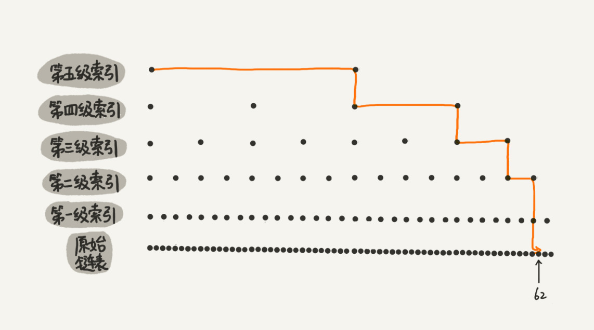
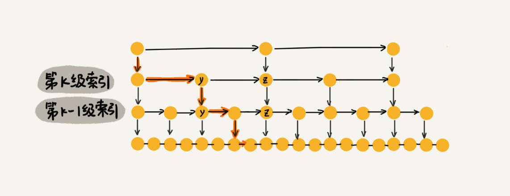
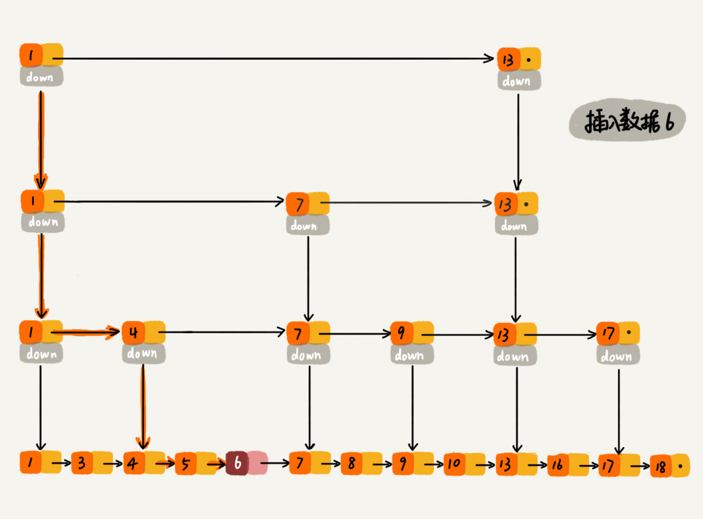
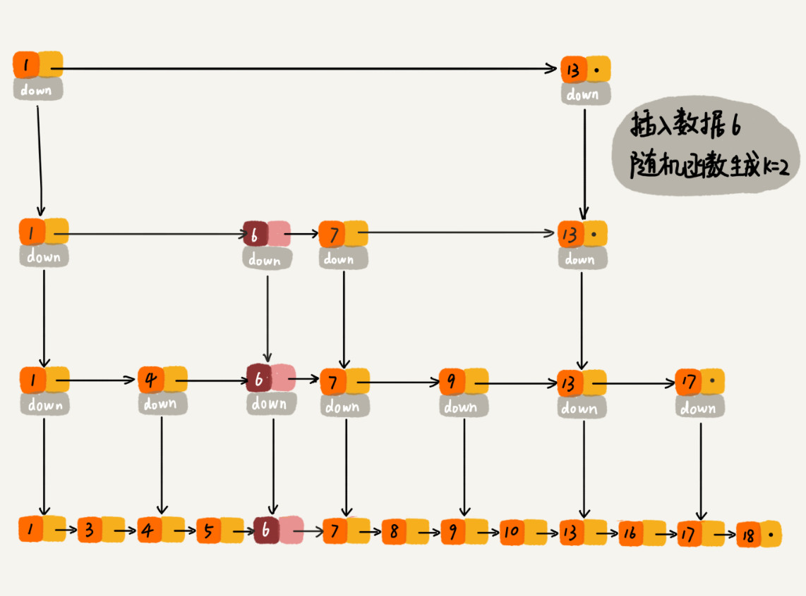

对于单链表，随机访问时只能从头到尾 O(n)。通过在其上建立**多级“索引”**，从而提高查询的效率。

第 k 级索引的结点个数是第 k-1 级索引的结点个数的 1/2，那第 k 级索引结点的个数就是 n/2k。

高度：log2n (包含原始链表)

每一级索引都最多只需要遍历 3 个结点，时间复杂度 O(3*logn) → O(logn)。

∵ ++索引节点，所以肯定需要更多的存储，空间复杂度 O(n-2) → O(n)。

每一级索引抽取越多的节点，消耗的空间越少，但搜索的次数/耗时会增加。

**高效插入/删除** O(logn)，删除除了要删除原始链表中的节点还要删除索引中的，∵ 要找到删除节点的前一个节点。

**动态更新**：如果不断插入不断更新索引，就会出现 2 个索引节点之间数据非常多，从而退化成单链表。

- 在加入数据的时候，同时将其加入部分索引层。通过随机函数决定插入到哪一级索引。

> 为什么 Redis 要用跳表来实现有序集合，而不是红黑树？

Redis 通过跳表实现 zset，支持插入/删除/查找/区间查找/迭代输出有序。

区间查找的效率比红黑树高，但没有现成的跳表，所以需要自己实现。