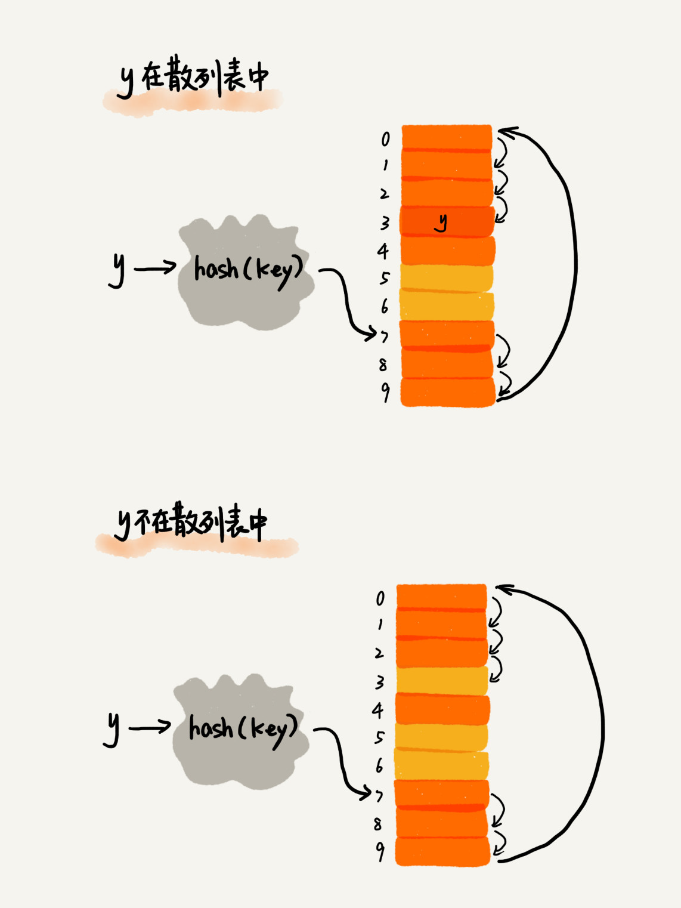

### Overview

散列表/哈希表：数组的一种扩展，直接通过下标/索引随机访问直接获取到想要的数据 O(1)。

k → hash(k) → v (in table) 

通过散列函数将 k 映射为下标/索引，然后将数据存储在数组中对应下标的位置。


:confused: **如何构造？**

1. hash(k) must be non-negative
2. if key1 = key2 then hash(key1) = hash(key2)
3. if key1 != key2 then hash(key1) != hash(key2) 否则冲突。

**查找**：比较所得 hash 值下标索引存在的值；如果没有找到顺序往后查找。



**删除**：不能单纯置空，而是标记 deleted。如果置空，那么查找时遇到就会判定为不存在。deleted 让查找时跳过继续探测。


### Conflict

**开放寻址法 Open addressing**：如果检测到冲突，重新探测 probing 一个新的空闲位置。

- Linear 线性：冲突所在的索引依次顺序往后找，如果到底了，则从头开始直到找到空闲。
  - :cry: 随着插入元素越多，冲突概率也会提高，线性探测耗时更长，最坏 O(n)。
  - **装载因子 Load factor**: 数组填充元素个数 / 数组长度。
- Quadratic 二次：hash(key)+0/1<sup>2</sup>/2<sup>2</sup>/3<sup>2</sup>...
- Double 双重：hash1(key), hash2(key), hash3(key)

:smile: 数据直接存储在数组中，可利用 CPU 缓存；易序列化。**适合小对象。**

:cry: 不易解决冲突，删除时额外标记，装载因子不能太大 → 导致空间浪费。

**链表法 Chaining**

- 每个 bucket/sloct 桶/槽 对应一个链表，冲突的元素 append 到链表。

:smile: 内存利用率更高，链表节点需要的时候才创建，容忍装载因子，**适合大对象 > 指针消耗。**

:cry: 额外指针存储，非连续内存对 CPU 缓存不友好


> Word 文档中单词拼写检查功能是如何实现的？

常用的英文单词有 20 万个左右，假设单词的平均长度是 10 个字母，平均一个单词占用 10 个字节的内存空间，那 20 万英文单词大约占 2MB 的存储空间，通过 hash table 存放在内存里。

### Design

不能太复杂，且 hash(k) 计算值要尽可能随机且均匀分布。

**装载因子过大？**（阈值触发）动态扩容，需要开辟新的数组空间，并重新计算 hash。

- 时间复杂度：平均摊还 O(1)，最坏 O(n)。


**避免低效扩容？**不等待扩容完成后再插入，而是申请完后直接插入新的数组，同时将部分数据迁移 = 均摊。


> 生产级别要求

1. 支持快速查询/插入/删除
2. 内存占用合理，不能浪费过多
3. 性能稳定；极端情况也不会退化到不能接收。

TODO

1. hash() 选择和涉及
2. 装载因子设置阈值
3. 支持动态扩容
4. 选择合适的冲突解决方法

### LRU

LRU 缓存的核心思想是维护一个按使用时间排序的数据结构，通常使用**双向链表+哈希表**来实现。

时间复杂度：查找/添加/删除 O(1) 即通过哈希表将查找的过程降低到 O(1)。

原理：

1. 当需要往缓存中**插入**数据时
   - 先尝试**获取**数据，检查该数据是否存在于缓存中。
     - 如果存在，则将该数据移动到 head，表示它是最近访问过的项目。
     - 如果不存在，则从数据源获取数据，并将其添加到缓存中的头部。
       - 如果缓存已满，删除 tail，加入到 head
       - 如果缓存未满，加入到 head
2. 当需要从缓存中**移除**数据时，将其从双向链表中删除即可。

**注：每个节点存放在两个链中**

1. prev/next 双向链表 doubly
2. hnext 哈希表单向链 singly


**3pp**

- `github.com/hashicorp/golang-lru`
- `github.com/golang/groupcache/lru`

### hash()

哈希算法/函数：将任意长度的二进制值串 → 定长的二进制值串，需满足：

- 不能逆向推导
- 变动敏感
- 冲突概率小
- 执行效率高

```bash
# linux
$ md5sum file
$ md5sum file1 file2 file3
$ find path/to/directory -type f -exec md5sum {} +
```

UC

1. **加密**：（防止原始数据泄露）MD5/SHA/DES/AES。
2. **唯一标识**：UUID-like。
3. **数据校验**：通过 hash 值是否变化判断文件是否被修改。
4. **负载均衡**：session-sticky 建立客户端的 IP 或者 sessionID 和服务器的映射关系。
5. **数据分片**：sharding 建立关键字和存储数据库的映射关系。
6. **一致性哈希**：环 + 虚拟节点。