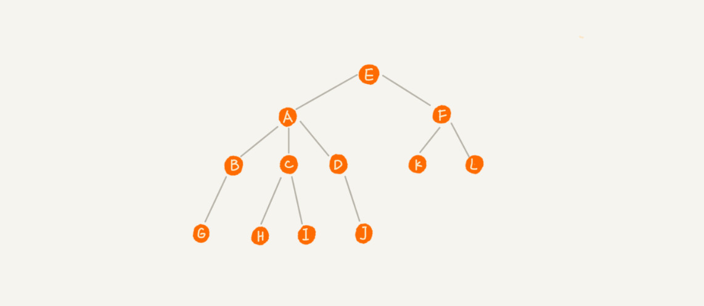

树 Tree **父/兄弟/子节点** Parent/Siblings/Child & **根/叶** Root/Leaf

**树高度 Heigth**：根节点到叶节点的边数（递减）

**深度 Depth**：根节点到这个节点的边数（递增）

**层数**：节点深度 + 1

### Binary Tree

**二叉树**：顾名思义，每个节点**最多**有两个“分叉”，**左右**两个子节点。

**满二叉树**：除叶节点，每个节点都有**左右**两个子节点。

**完全二叉树**：叶节点都在最底下两层，最后一层的叶子节点都靠左排列，且除最后一层，都有**左右**两个子节点。

:confused: **如何表示/存储二叉树？**

1. 基于指针的**链式**存储：*left *right 常用。

2. 基于数组的**顺序**存储：root=a[i]，left=a[2i]，right=a[2i+1] (从下标 1 开始)。空间利用率：(n-1)/n。

   数组适合保存完全二叉树，对于非完全二叉树，浪费的空间要更多。

**遍历 Iter** → 递归！时间复杂度 O(n) 每个节点最多被访问两次，跟节点个数成正比。

**Preorder 前序**：**当前节点** → 左子树 → 右子树

**Inorder 中序**：左子树 → **当前节点** → 右子树；

**Postorder 后序**：左子树 → 右子树 → **当前节点**

### BSearch Tree

二叉查找树：任意一个节点，其<u>左/右子树</u>中的每个节点的值，都要<u>小于/大于</u>这个节点的值。

**中序遍历可以得到有序的序列。**所以也叫二叉排序树。

**查找**：从根开始，如果要找的值比根小，则递归查找左子树，否则查找右子树。

**插入**：从根开始，如果要插入的数据比节点的数据大/小，则递归遍历右/左子树，直到其右/左节点为空。

**删除**：

1. 如果要删除的节点**没有子节点**，我们只需要直接将父节点中指向要删除节点的指针置为 null。(55)
2. 如果要删除的节点**只有 1 个子节点**，将父节点指向该节点的指针指向删除节点的子节点即可。(15)
3. 如果要删除的节点**有 2 个子节点**，找到这个节点的右子树中的最小节点，替换到要删除的节点；然后再删除这个最小节点（无左节点）。 (18)

我们还可以取巧单纯将其标记为"Deleted"，同**查找**。

**快速查找 max/min 节点**：最右叶节点 & 最左叶节点。

**快速查找 prev/next 节点**：

**支持重复数据**：

1. 链表 + 动态扩容数组，对于 key 相同的数据可以存在一个节点上。
2. 每个节点仍存一个数据
   - 插入：把这个新插入的数据当作大于这个节点的值来处理，往右子树走。
   - 查找：遇到值相同节点不停止，继续右子树查找，直到遇到叶节点。
   - 删除：先查找到所有值相同给的节点，按之前的方式依次删除即可。

**时间复杂度**：

最坏：O(n) 退化成链表。

最好：O(height) → 完全/满：O(log2N)。

### Red/Black Tree

平衡二叉树：任意一个节点的左右子树的高度相差不能大于 1。

通俗一点：是让整棵树左右看起来比较“对称”、比较“平衡”，保证高度相对低，避免退化，从而提升操作的效率。

红黑树，**平衡**二叉查找树的一种实现（并不严格）。节点标记类别：红色 & 黑色，要求：

- **根**节点是**黑**色的。
- 每个**叶**子节点都是**黑**色的空节点（NIL），也就是说，叶子节点不存储数据。
- 任何相邻的节点都不能同时为红色，也就是说，**红黑间隔**。
- 每个节点，从该节点到达其可达叶子节点的所有路径，都包含相同数目的黑色节点

**近似平衡？** 平衡 = 性能不退化，判断红黑树的高度是否接近 O(log2N)

- 如果我们**将红色节点从红黑树中去掉**，那单纯包含黑色节点的红黑树的高度是多少呢？
  - Child → ~~Parent~~ → GrandParent
  - 二叉 → 二叉 ~ 四叉
  - 仅包含黑色节点的四叉树的高度，比包含相同节点个数的完全二叉树的高度还要小，不会超过 O(log2N)。
- 再次**将红色节点加回去**
  - 红色节点不能相邻 = 红色节点之间必有一个黑色节点
  - ∵ 黑色节点路径不会超过 O(log2N)，∴ 红色节点路径不会超过 O(2xlog2N)

**实现** (Option)

- 学习红黑树的代码实现，对于你平时做项目开发没有太大帮助。
- 对于绝大部分开发工程师来说，这辈子你可能都用不着亲手写一个红黑树。
- 一般情况下，靠谱的面试官也不会让你手写红黑树的。

### Recursion Tree

借助递归树来分析递归算法的时间复杂度 → 将分解的过程描述成树结构。

MergeSort

- 合并耗时，每一层合并耗时总和相同，记为 n。
- 只需要知道树的高度，即可得 O(n * h) where MergeSort 属于满二叉，h=log2n。

QuickSort

- 每次分区之后，两个分区的大小比例为 1：k，这里我们取 k = 9
- 每一层分区操作所遍历的数据的个数之和就是 n
- 只需要知道树的高度，即可得 O(n * h)
  - 从根节点到叶子节点的最短路径是 log10n，最长的路径是 log10/9n

Fib

- 每一次合并消耗 1，第 n 层消耗 2n-1
- 如果每次 -1 那么最长路径 n，求和 1+2+... 2n-1 = 2n-1；
- 如果每次 -2，那么最短路径 n/2，求和 1+2+... 2n/2-1 = 2n/2-1；

Permutation 全排列

- 如果我们确定了最后一位数据（n 种取值），那就变成了求解剩下 n-1 个数据的排列问题。
- 分解成 n 个 n-1 个数据得排列。
- 第 k 层总的交换次数 $$n*(n-1)*(n-2)*(n-k+1)$$
- 求和：$$n + n*(n-1) + n*(n-1)*(n-2) +... + n*(n-1)*(n-2)*...*2*1$$
  - 最后一项为 n!，前项都小于 n!，所以最终肯定小于 n * n!

