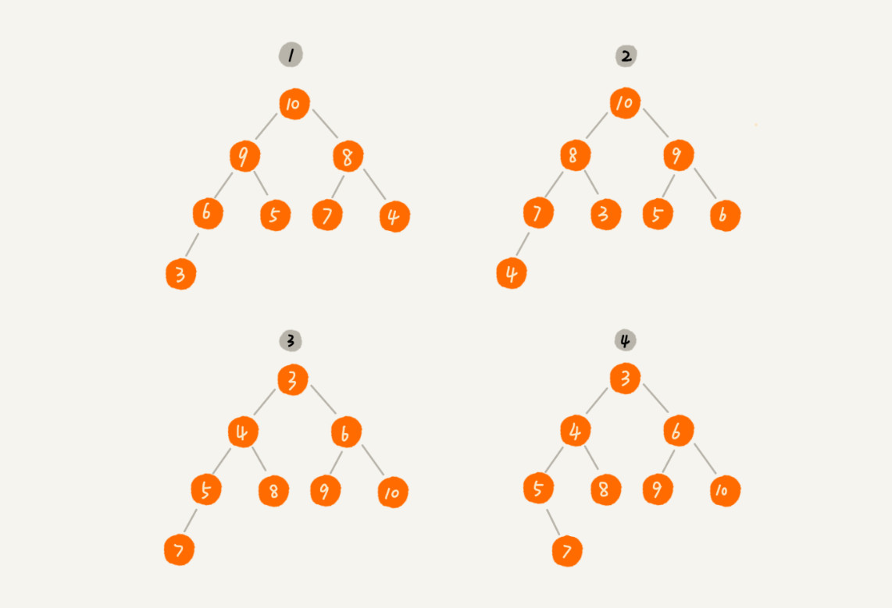
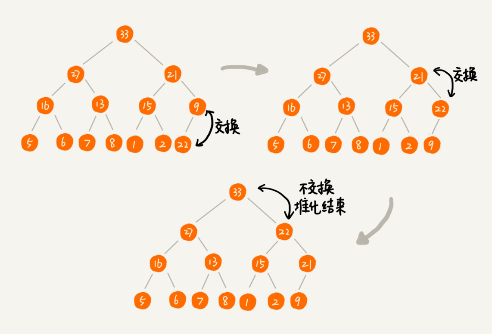
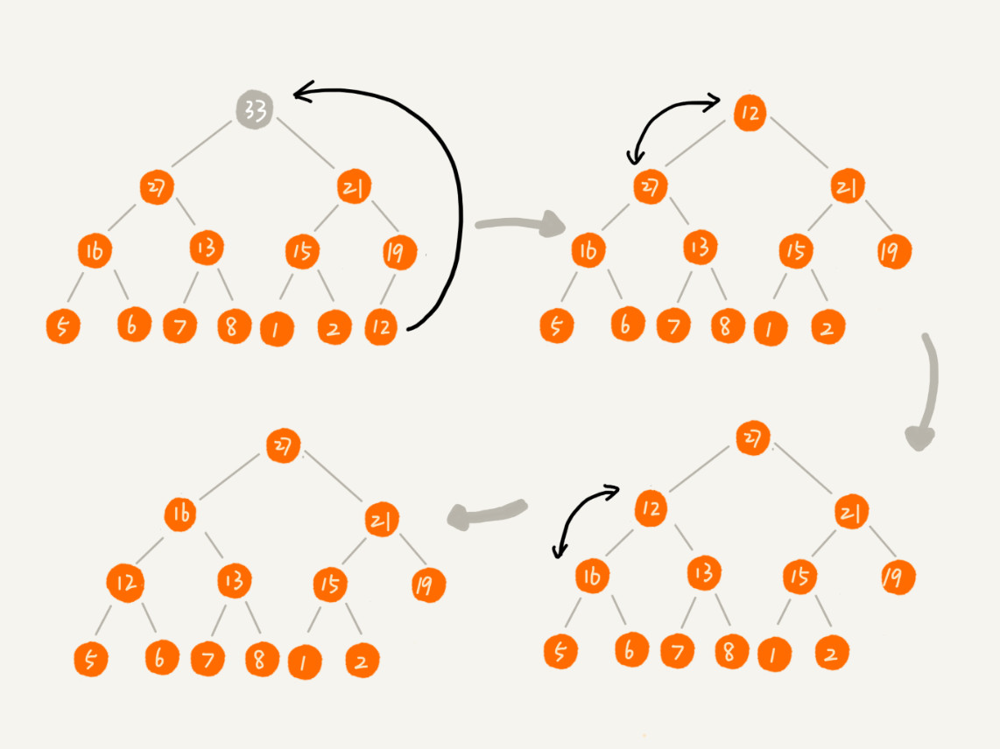
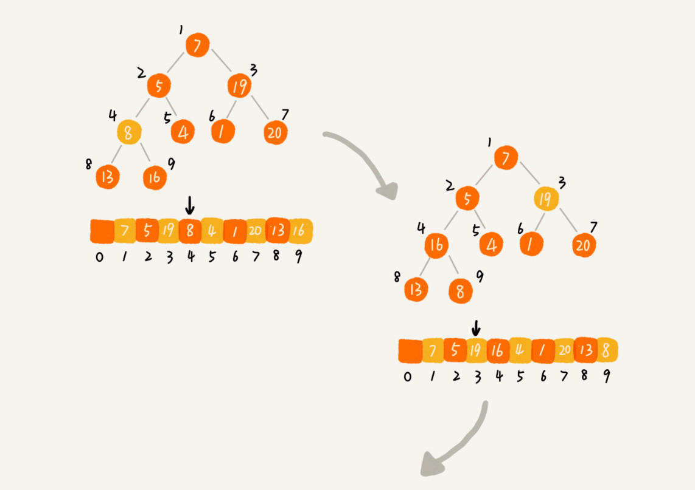
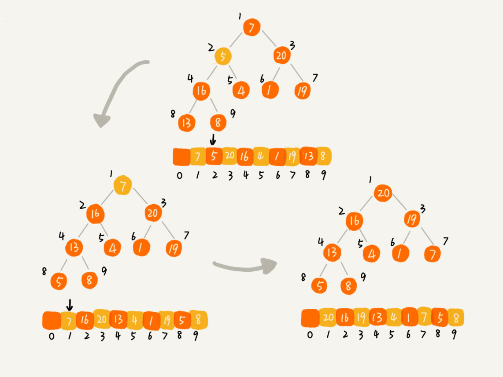
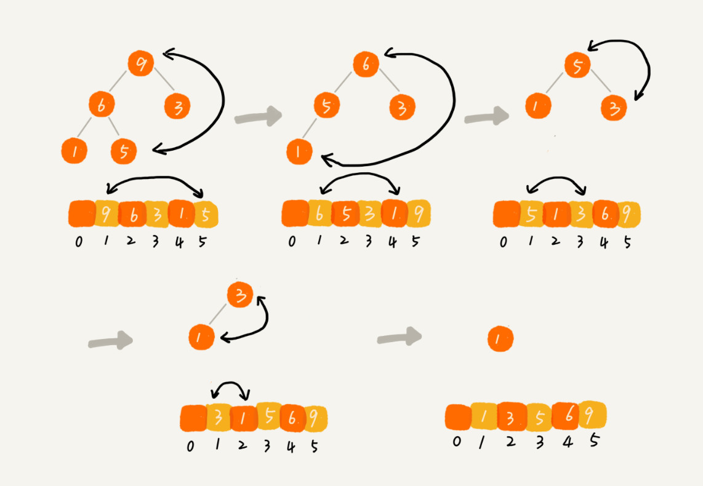
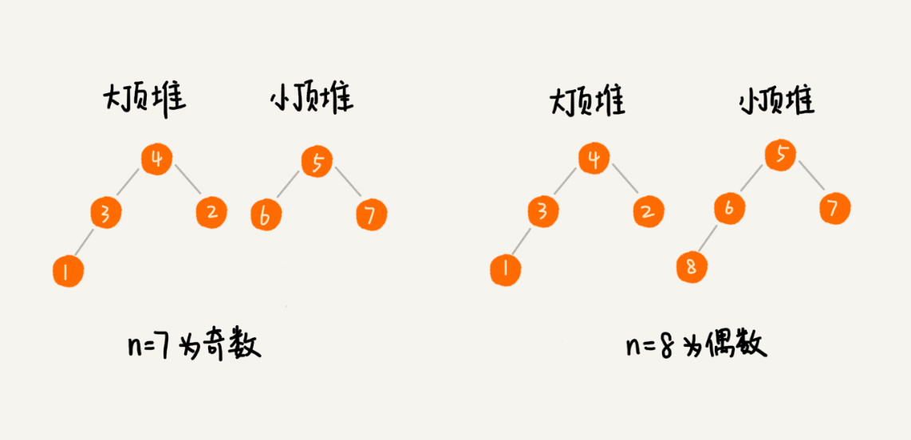
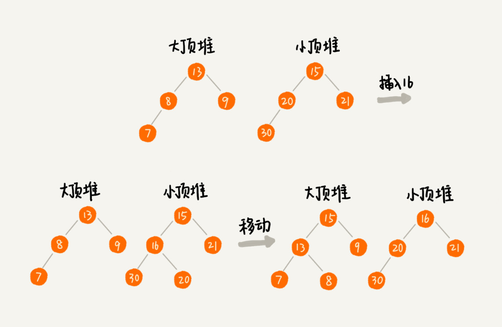

**堆 Heap** 完全二叉树，即除了最后一层，其他层的节点个数都是满的，最后一层的节点都靠左排列。

堆中每一个节点的值都必须大于等于（或小于等于）其子树中每个节点的值。

**最大堆**：每个节点的值都**大于等于**子树中每个节点值。

**最小堆**：每个节点的值都**小于等于**子树中每个节点值。

注：4 不是堆，不符合完全二叉树。

**实现**：完全二叉树适合用**数组存储**，只需通过下标即可访问，**空间利用率高**。

- 若下标从 0 开始，父节点 a[i]，左节点 a[2i+1]，左节点 a[2i+2]
- 若下标从 1 开始，父节点 a[i]，左节点 a[2i]，左节点 a[2i+1]

**Heapify 堆化**：重新调整节点的位置以满足堆的特性 = **顺着节点所在的路径，向下/向上，对比交换。**

**自下而上<u>插入</u>(到数组最后一个位置)**：将插入的节点与父节点比较，如果不满足条件 (大于/小于) 则不断重复，直到满足条件。

**自上而下删除（数组种最后一个元素）**：将最后一个节点放到堆顶，然后利用同样的父子节点对比方法。对于不满足父子节点大小关系
的，交换直到满足条件位置。

**堆排序**：**原地**稳定

1. **建堆** O(n)

   a. 上述提到的从下标 1 开始，依次往后插入，自下而上堆化。

   **b. 自下而上堆化，从第一个非叶节点开始（∵ 叶节点向下堆化只能和自己比较，没必要）**

   - **对于完全二叉树，下标 n/2 ~ n 都是叶节点。**

2. **排序** O(nlogn) 建堆后已满足堆特性，将堆顶移到最后，对剩余 n-1 个进行堆化。

> 实际开发中，为什么快速排序 > 堆排序？

1. 快速排序访问是下标连续，而堆排序是跳跃的，对 CPU 缓存不友好。
2. 对同样的数据，堆排序需要交换的次数要更多。

### UC

**优先级队列**：往优先级队列中插入一个元素，就相当于往堆中插入一个元素；从优先级队列中取出优先级最高的元素，就相当于取出堆顶元素。

> 合并有序小文件：假设我们有 100 个小文件，每个文件的大小是 100MB，每个文件中存储的都是有序的字符串。我们希望将这些 100 个小文件合并成一个有序的大文件。

将从小文件中取出来的字符串放入到最小堆中，堆首就是最小的字符串，依次放入大文件中并从堆中删除。

> 高性能定时器：定时器中维护了很多定时任务，每个任务都设定了一个要触发执行的时间点。

按照任务设定的执行时间，将这些任务存储在优先级队列中，队列首部（最小堆的堆顶）存储的是最先执行的任务。只要每次从堆顶获取与当前时间点的时间间隔 T，无需不断扫描，等待 T 后执行即可。

**Top K**：

维护一个大小为 K 的最小堆，顺序遍历数组，从数组中取数据与堆顶元素比较。**如果比堆顶元素大，我们就把堆顶元素删除，并且将这个元素插入到堆中；如果比堆顶元素小，则不做处理，继续遍历数组。**这样等数组中的数据都遍历完之后，堆中的数据就是前 K 大数据了。

遍历 O(n) * 堆化 O(logK)

**中位数**：奇数 n/2 + 1；偶数 n/2

维护 2 个堆，max 存前半，min 存后半，且数据都大于 max 中的数据。

- 如果偶数，那么 max 中堆顶就是中位数
- 如果奇数，max 存 n/2+1，min 存 n/2

对于动态数据：将这个新数据插入到大顶堆；如果新加入的数据**大于等于**小顶堆的堆顶元素，我们就将这个新数据插入到小顶堆。遇到不满足约定的情况，可以将 max 顶不断移动到 min 上。

插入移动需要堆化 O(logn) + 弹 max 顶 O(1)

> 99% 响应时间：小于等于某个响应时间的个数占总数的 99%

max 存 99%n 个数据，小顶堆中保存 1%n 个数据。大顶堆堆顶的数据就是我们要找的 99% 响应时间。