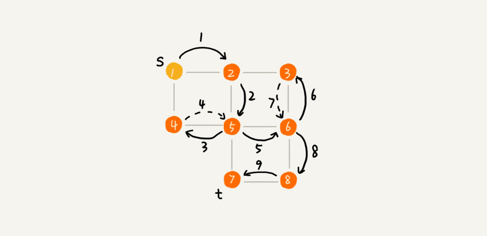

图 Graph = 顶点 vertex + 边/度 edge/degree

无向图：边/度无方向

有向图：边/度带方向 → In/Out 入/出，表示有多少个指入/指出。（微信/微博）

无权图：边/度无权重

有权图：边/度有权重（QQ好友亲密度）

**存储**：

**邻接矩阵 Adjacency Matrix** 空间换时间

- 无向图：如果顶点 i 与顶点 j 之间有边，我们就将 A\[i][j] 和 A\[j][i] 标记为 1。
- 有向图：如果有一条箭头从顶点 i 指向顶点 j 的边，那我们就将 A\[i][j] 标记为 1。
- 有权图：A\[i][j] 标记为对应的权重值。

:smile: 简单，高效，方便计算（基于矩阵）。

:cry: 浪费存储空间，对于无向图 A\[i][j] 即 A\[j][i]，只需要存一个就好了，浪费一半。

**邻接表 Adjacency List** 时间换空间

类散列表，每个顶点对应一条链表，链表中存储的是与这个顶点相连接的其他顶点。

优化：将链表改成平衡二叉查找树（生产：红黑树），也可以改成有序动态数组，通过二分查找。

> 如何存储微博、微信等社交网络中的好友关系？

邻接表：用户关注了谁

逆邻接表：用户被谁关注了

改进：跳表，用户按字典排序，时间 O(logn) 空间 O(n)

数据规模过大，可以选择数据分片 sharding，通过 hash 将表存在不同的主机上。

### Search

**“搜索”：从图中找出从一个顶点到另一个顶点的路径。**

**Breadth-first 广度优先**

- **visited** 是用来记录已经被访问的顶点，true 表示已访问。
- **queue** 存储已经被访问、但相连的顶点还没有被访问的顶点。将第 k 层要访问的顶点入队，访问完出队同时将第 k+1 层的顶点入队。
- **prev** 记录搜索路径，反向存储，prev[w] 存储的是，顶点 w 是从哪个前驱顶点遍历过来的。
- 时间 O(Edge) 空间 O(Vertex)

**Depth-first 深度优先**

- 基于**递归**的 “回溯思想” Maze-like。
- ++ found：当我们已经找到终止顶点 t 之后，我们就不再递归地继续查找了。
- 每条边最多会被访问两次，一次遍历/一次回退。
- 时间 O(Edge) 空间 (Vertex)

