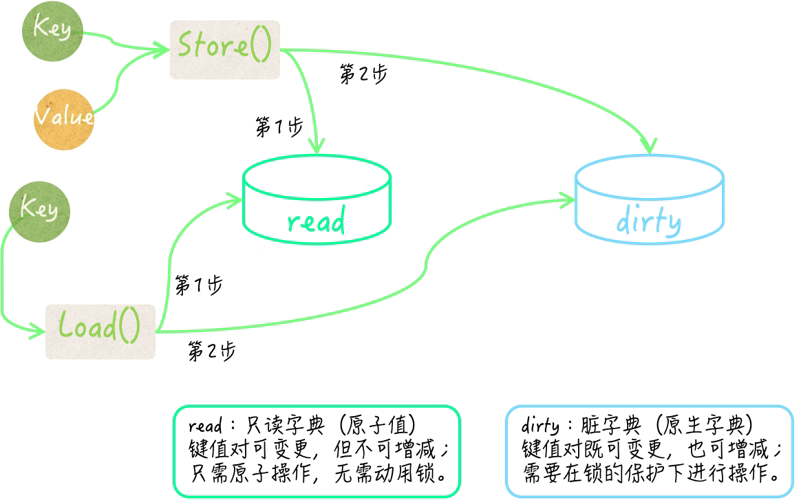
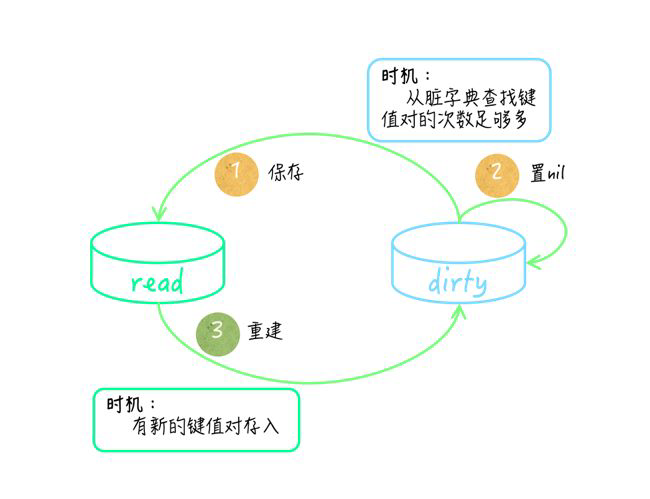

`sync.Map` is like a Go map[any]any but is **safe for concurrent use by multiple goroutines** without additional locking or coordination. Loads, stores, and deletes run in amortized constant time.

:smile:

1. When the entry for a given key is only ever written once but **read many times**, as in caches that only grow.
2. When multiple goroutines read, write, and overwrite entries for **disjoint** sets of keys.

```go
package main

import (
    "fmt"
    "sync"
)

func main() {
    var sm sync.Map

    // store
    sm.Store("key1", "value1")
    sm.Store("key2", 42)

    // load
    if value, ok := sm.Load("key1"); ok {
        fmt.Println("Loaded key1:", value)
    } else {
        fmt.Println("Key1 not found")
    }

    // store if not found, load if found
    if value, loaded := sm.LoadOrStore("key3", "value3"); loaded {
        fmt.Println("Loaded existing key3:", value)
    } else {
        fmt.Println("Stored new key3 value")
    }

    // delete
    sm.Delete("key1")

    // iter
    sm.Range(func(key, value interface{}) bool {
        fmt.Println("Key:", key, "Value:", value)
        return true
    })
    
    // compare & deleted if same val
    sm.Store("key1", "value1")
    deleted := sm.CompareAndDelete("key1", "value1")
    
    // compare & swap if same val
    sm.Store("key1", "value1")
    swapped := sm.CompareAndSwap("key1", "value1", "value2")
    
    // load & deleted
    sm.Store("key1", "value1")
    value, loaded := sm.LoadAndDelete("key1")
    
    // swap & return prev
    sm.Store("key1", "value1")
    previous, loaded := sm.Swap("key1", "value2")
    
}
```

### Deepin

K/V 都是 interface{} 所以要对值进行**类型断言**。

**对 K 的要求**

- 必须可判等/可比。
- 不能是 slice/map/func 类型会直接编译错误；不可比，无法计算稳定 hash (动态变化)。

**如何保证 K/V 类型正确性？**

> 1. 将其**封装进结构体**，使用方法进**代理**到 `sync.Map`，借助编译器进行类型判断。缺点：其他类型，要重写一遍...

```go
type IntStrMap struct {
	m sync.Map
}

func (iMap *IntStrMap) Load(key int) (value string, ok bool) {
	v, ok := iMap.m.Load(key)
	if v != nil {
		value = v.(string)
	}
	return
}

func (iMap *IntStrMap) Store(key int, value string) {
	iMap.m.Store(key, value)
}
```

> 2. 结构体中包含 K/V 类型字段，类型为 `reflect.Type`，通过 `reflect.TypeOf(k/v)` 判断是否符合。 

```go
type ConcurrentMap struct {
	m sync.Map
	keyType reflect.Type
	valueType reflect.Type
}

func (cMap *ConcurrentMap) Load(key interface{}) (value interface{}, ok bool) {
	if reflect.TypeOf(key) != cMap.keyType {
        return
    }
    return cMap.m.Load(key)
}

func (cMap *ConcurrentMap) Store(key, value interface{}) {
	if reflect.TypeOf(key) != cMap.keyType {
		panic(fmt.Errorf("wrong key type: %v", reflect.TypeOf(key)))
    }
    if reflect.TypeOf(value) != cMap.valueType {
        panic(fmt.Errorf("wrong value type: %v", reflect.TypeOf(value)))
    }
    cMap.m.Store(key, value)
}
```

**内部结构**：适用大量原子操作存取 K/V，适用两个原生 map 作存储。尽可能避免锁（仅写）。

1. `read` 只读字典，类快照保存所有 K/V，不可变，**因为是 atomic.Value 类型，所以无需加锁**。
2. `dirty` 记录写入，可变，需要 mutex 保护。
3. `misses` 计数器记录未命中 read 的次数，当达到一定数量（运行时调整），dirty 会**转换**成 read，同时 dirty 置 nil。

```go
type Map struct {
	mu     sync.Mutex
	read   atomic.Value // readOnly
	dirty  map[interface{}]*entry
	misses int
}
```

**Load** 先查找 read （无需加锁），若没有从 dirty 中找（需加锁）。

**Store** 先查找 read 看是否存在 K，若存在且未标记为“已删除”，则存 read（无需加锁）；否则存 dirty。

**Delete** 先查找 read 是否有 K（无需加锁），若无则从 dirty 中找并删除（需加锁）。



**相互转换**：在 dirty 查找键值对次数足够多的时候，`sync.Map` 会把 dirty 直接作为 read，保存在它的read 字段中，然后把代表脏字典的 dirty 字段的值置为 nil。

