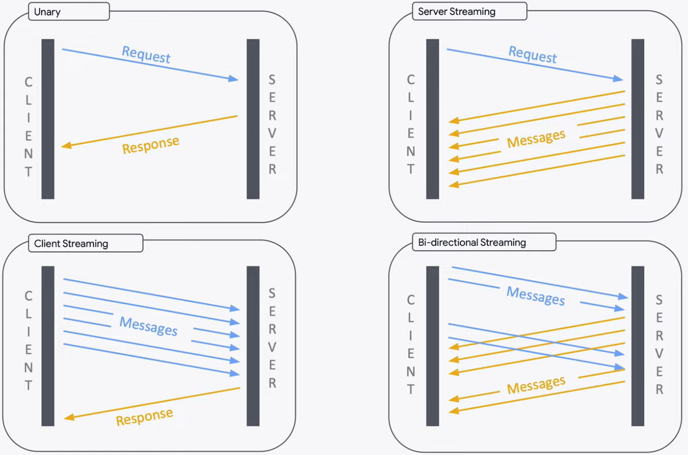

## RPC

Remote Procedure Call 远程过程调用，是一种协议/规范，对应的实现 [Dubbo](https://dubbo.apache.org/)、[Thrift](https://thrift.apache.org/)、[gRPC](https://grpc.io/)、[Hetty](https://hetty.xyz/)。

定义：客户端请求远程主机服务/进程，而无需了解底层网络技术 = **透明**。

- 既然 RPC 的客户端认为自己是在调用本地对象，那么传输层使用什么协议就无需 care = 透明。
- 同理，消息格式的构成，客户端也无需关心。
- 同理，服务器无论使用什么语言，调用都应该成功。

### Why RPC？

传统单体 → 云原生微服务，需要一种高效透明应用程序之间的通讯手段。

### RPC Mechanism

既然要求**透明**，那么需要对通信细节进行**封装**。

1. 客户端发起调用 Call。

2. 客户端 stub 封装消息体 Marshalling。

3. 调用 PRC 运行时发送消息。

4. 服务端接收解封 Unmarshalling 处理返回，调用服务器 stub 封装消息体 Marshalling。

5. 调用 PRC 运行时发送消息。

6. 服务端接收解封 Unmarshalling 处理返回。

   


## [gRPC](https://grpc.io/docs/what-is-grpc/introduction/)

> 性能: HTTP/2 (头部压缩/基于 Stream 并发/二进制帧编码) + protobuf (高效序列化)

gRPC 一开始由 google 开发，是一款语言中立、平台中立、开源的远程过程调用 RPC 系统，基于 HTTP/2。

流程：

1. 定义一个服务，指定其能够被远程调用的方法（包含参数和返回类型）。
2. 服务端实现该接口，并运行 gRPC 服务器。
3. 客户端拥有一个 stub 提供同服务端一样的方法。

**Features**:

- LB
- Security
- Observability
- SD
- Codec/Compression


### [ProtoBuf](https://protobuf.dev/)

Protocol Buffers：Google 开源的成熟的**结构数据序列化机制** JSON/XMLlike but simpler, smaller & faster。

ProtoBuf 是一种与语言和平台无关的**接口定义语言 IDL，定义服务暴露的方法以及请求/响应的格式**。

### Service Definition

服务定义，即声明一个方法（参数列表+返回值）能够让远程进行调用。

```go
service HelloService {
  rpc SayHello (HelloRequest) returns (HelloResponse);
}

message HelloRequest {
  string greeting = 1;
}

message HelloResponse {
  string reply = 1;
}
```

### Using the API

**Protobuf file `.proto` → Codegen → Generated Source Code**

- Server：需实现声明方法 + 启动 gRPC server
- Client：本地对象 stub 实现了 Server 相同的方法，客户端直接调用。

### Life Cycle

> - 适用于请求-响应模式，像传统的 HTTP 请求-响应。
> - 适用于短期交互，不需要持续的数据流。

- **Unary**: single req & single res
1. 一旦客户端调用了 stub，服务器便会收到通知，知道该 RPC 已被调用，并接收到该调用的客户端元数据、方法名称和（如果适用的话）指定的截止时间。
  
2. 服务器可以立即发送其初始元数据（这必须在发送任何响应之前进行），或者等待客户端的请求消息。哪个先，取决于具体实现。
  
3. 一旦服务器收到客户端的请求消息，它会进行必要的工作来创建和填充响应。响应创建完成后（如果成功），会连同状态详情（状态码和可选的状态消息）以及可选的尾随元数据一起返回给客户端。
  
4. 如果响应状态是 OK 的，那么客户端将收到响应，从而在客户端一侧完成调用。
  

> - 适用于服务器端需要向客户端传输大量数据的情况，比如日志流或实时监控数据。
> - 适用于单向数据传输的场景，如向客户端推送事件流。

- **Server Streaming**: single req & stream res
- 服务器返回 stream 消息来响应客户端的请求。
  
- 在发送完所有消息之后，服务器的状态详情（状态码和可选的状态消息）以及可选的尾随元数据会发送给客户端。
  

> - 适用于客户端需要向服务器端发送大量数据的情况，比如上传大文件或数据流。
> - 适用于集合处理场景，如客户端发送一系列数据到服务器端进行批量处理。

- **Client Streaming**: stream req & single res

  - 客户端发送 steram 消息给服务器，而不是一条消息
  - 。服务器会返回一条消息（以及其状态详情和可选的尾随元数据），通常是在收到客户端所有消息之后


> - 适用于需要双向实时通信的场景，如聊天应用、实时协作工具、实时游戏等。
> - 适用于需要持续交互的场景，双方可以同时发送和接收数据。

- **Bidirectional streamin**: stream req & stream res
- 两个流是独立的，客户端和服务器可以以任何顺序读取和写入消息, wait-all or ping-pong.

```go
// .proto
rpc SayHello(HelloRequest) returns (HelloResponse);
rpc LotsOfReplies(HelloRequest) returns (stream HelloResponse);
rpc LotsOfGreetings(stream HelloRequest) returns (HelloResponse);
rpc BidiHello(stream HelloRequest) returns (stream HelloResponse);
```



**Deadlines/Timeouts**

客户端可指定超时实践 + `DEADLINE_EXCEEDED` error。

服务端可以查询是否超时以及剩余时间（以完成 RPC）。

**RPC termination**

客户端和服务端独立判断调用的成功与否，他们的判断结果可能不一致。

**Cancelling an RPC**

客户端和服务端可以在任何时刻取消一个 RPC，取消会直接中止调用。

**Channels**

通道提供了与指定主机和端口上的 gRPC 服务器的连接；创建客户端 stub 时使用。客户端可以指定通道参数，以修改 gRPC 的默认行为。通道有状态：`connected` or `idle`。

## [Go](https://grpc.io/docs/languages/go/)

### Quickstart

客户端/服务器 stub 都有一个 `SayHello()` RPC 方法，客户端接受一个 `HelloRequest` 参数，从服务器获得 `HelloReply` 响应。

```go
// The greeting service definition.
service Greeter {
  // Sends a greeting
  rpc SayHello (HelloRequest) returns (HelloReply) {}
}

// The request message containing the user's name.
message HelloRequest {
  string name = 1;
}

// The response message containing the greetings
message HelloReply {
  string message = 1;
}
```

++ Method in `helloworld/helloworld.proto`

```go
// The greeting service definition.
service Greeter {
  // Sends a greeting
  rpc SayHello (HelloRequest) returns (HelloReply) {}
  // ++
  rpc SayHelloAgain (HelloRequest) returns (HelloReply) {}
}

// The request message containing the user's name.
message HelloRequest {
  string name = 1;
}

// The response message containing the greetings
message HelloReply {
  string message = 1;
}
```

Regen gRPC code `helloworld/helloworld.pb.go` & `helloworld/helloworld_grpc.pb.go`

```go
$ protoc --go_out=. --go_opt=paths=source_relative \
    --go-grpc_out=. --go-grpc_opt=paths=source_relative \
    helloworld/helloworld.proto
```

Update the server

```go
// ++
func (s *server) SayHelloAgain(ctx context.Context, in *pb.HelloRequest) (*pb.HelloReply, error) {
        return &pb.HelloReply{Message: "Hello again " + in.GetName()}, nil
}
```

Update the client

```go
// ++
r, err = c.SayHelloAgain(ctx, &pb.HelloRequest{Name: *name})
if err != nil {
        log.Fatalf("could not greet: %v", err)
}
log.Printf("Greeting: %s", r.GetMessage())
```

Run

```bash
$ go run greeter_server/main.go
$ go run greeter_client/main.go --name=Alice
```

### Basics

A simple route mapping app that

- lets clients **get information about features** on their route
- **create a summary** of their route
- **exchange route information** such as traffic updates with the server and other clients.

1. Define the service in `.proto`

```protobuf
service RouteGuide {
   // unary RPC
   rpc GetFeature(Point) returns (Feature) {}
   // server streaming
   // The client reads from the returned stream until there are no more messages.
   rpc ListFeatures(Rectangle) returns (stream Feature) {}
   // client streaming
   // It waits for the server to read them all and return its response.
   rpc RecordRoute(stream Point) returns (RouteSummary) {}
   // Bi-directional
   // Two streams operate independently
   rpc RouteChat(stream RouteNote) returns (stream RouteNote) {}
}
```

2. Generate client & server interface from `.proto`

- `route_guide.pb.go`: 包含所有 protobuf 需要填充/序列化/获取请求响应的 message 类型 (及方法)。
- `route_guide_grpc.pb.go`: client/server interface (to be impl)

```bash
$ protoc --go_out=. --go_opt=paths=source_relative \
    --go-grpc_out=. --go-grpc_opt=paths=source_relative \
    routeguide/route_guide.proto
```

3. Creating the server

- `routeGuideServer` strcut & methods which impl the server interface.

```go
type routeGuideServer struct

func (s *routeGuideServer) GetFeature(ctx context.Context, point *pb.Point) (*pb.Feature, error)
func (s *routeGuideServer) ListFeatures(rect *pb.Rectangle, stream pb.RouteGuide_ListFeaturesServer) error {
func (s *routeGuideServer) RecordRoute(stream pb.RouteGuide_RecordRouteServer) error {
func (s *routeGuideServer) RouteChat(stream pb.RouteGuide_RouteChatServer) error {
```

4. Starting the server

```go
lis, err := net.Listen("tcp", fmt.Sprintf("localhost:%d", port))
var opts []grpc.ServerOption
...
// create grpc server
grpcServer := grpc.NewServer(opts...)
// reg into 
pb.RegisterRouteGuideServer(grpcServer, newServer())
// serve in blocking wait until proc is killed or Stop() is called
grpcServer.Serve(lis)
```

5. Creating the client

```go
var opts []grpc.DialOption
...
// create a gRPC *channel* to communicate with the server.
conn, err := grpc.NewClient(*serverAddr, opts...)
if err != nil {
  ...
}
defer conn.Close()
```

```go
// create stub to perform RPCs
client := pb.NewRouteGuideClient(conn)

feature, err := client.GetFeature(context.Background(), &pb.Point{409146138, -746188906})
stream, err := client.ListFeatures(context.Background(), rect)
stream, err := client.RecordRoute(context.Background())
stream, err := client.RouteChat(context.Background())
```

6. Run

```bash
$ go run server/server.go
$ go run client/client.go
```

