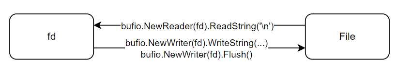

文件：**数据源**的一种，主要用于**保存数据**；形式可以是文本/图片/音频视频。

流 Stream：描述数据源（文件） & 程序（内存）之间的路径。

- InputStream 输入流：程序（内存）← 数据源（文件）
- OutputStream 输出流：程序（内存）→ 数据源（文件）





```go
// read-only
file, err := os.Open("/path/to/file")
if err != nil {
	fmt.Println("Error opening file:", err)
	return
}
// file is a ptr = fd
fmt.Printf("file= %v", file)
defer file.Close()
```

**打开文件**

`os.OpenFile` 允许指定打开文件的模式

- `os.O_RDONLY`：只读模式
- `os.O_WRONLY`：只写模式
- `os.O_RDWR`：读写模式
- `os.O_APPEND`：追加模式
- `os.O_CREATE`：如果文件不存在，则创建
- `os.O_TRUNC`：如果文件已存在，打开时清空文件
- `os.O_EXCL`：与 `os.O_CREATE` 一起使用，文件必须不存在

```go
file, err := os.OpenFile("./sample.txt", os.O_WRONLY|os.O_CREATE, 0666)
if err != nil {
	fmt.Println(err)
}
defer file.Close()
```

**读取**

`file.Read` 一次性读取数据存入字节切片 as Buffer 返回读取到的字节数，可 make 自定义大小。

```go
buf := make([]byte, 1024)

for {
	n, err := file.Read(buf)
	if err != nil {
		if err == os.ErrClosed {
			fmt.Println("File closed.")
			break
		} else if err == io.EOF {
			if n > 0 {
				fmt.Print(string(buf[:n]))
			}
			fmt.Println("Reached end of file.")
			break
		} else {
			fmt.Println("Error reading file:", err)
			break
		}
	}
	fmt.Print(string(buf[:n]))
}
```

`os.ReadFile` 全部读取到内存中；若文件太大，可能会导致内存溢出 :warning:

```go
byteString, err := ioutil.ReadFile("/path/to/file")
fmt.Println(string(byteString))
```

`bufio.NewReader` 提供了高效的**缓冲**读取功能，可以**逐行读取**文件内容。:smile:

```go
reader := bufio.NewReader(file)

for {
		line, err := reader.ReadString('\n')
		if err != nil {
			if err == io.EOF {
				fmt.Println(line)
				break
			}
			fmt.Println(err)
			break
		}
		fmt.Println(line)
	}
```

**写入**

`buffio.NewWriter` 提供了一个高效的方式来进行**缓冲**写入操作，通过减少实际的 I/O 操作次数来提高写入性能，最后须通过 flush 落盘。

```go
file, err := os.OpenFile("/path/to/write", os.O_WRONLY|os.O_CREATE, 0666)
file,err := os.OpenFile("/path/to/write",os.O_O_RDWR | os.O_APPEND,0666)

writer := bufio.NewWriter(file)
writer.WriteString(str)
writer.Flush()
```

**判断是否存在**

`os.Stat()` 

```go
func PathExists(path string) (bool, error) {
	_, err := os.Stat(path)
	if err == nil {
		return true, nil
	}
	if os.IsNotExist(err) {
		return false, nil
	}
	return false, nil
}
```

**复制**

1. 打开源文件
2. 创建目标文件
3. 创建 reader & writer
4. 循环读取源文件并写入目标文件
5. writer flush
6. 关闭源文件 & 目标文件

```go
io.Copy(writer, reader)
```

**统计**

**逐行遍历**统计该行有多少个 英文、数字、空格和其他字符，并保存到一个结构体。

```go
type CharCount struct {
	az    int
	num   int
	space int
	other int
}

line, err := reader.ReadString('\n')

for _, v := range line {
    swtich {
    	// TODO
    }
}
```

