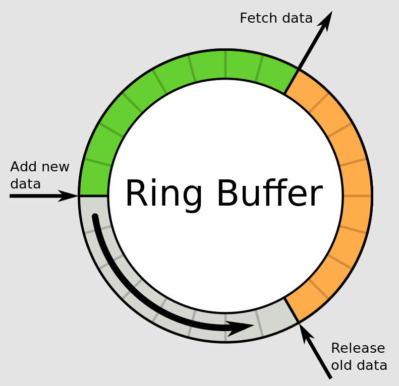

Ring Buffer 环形缓冲/循环队列，对于多用户读写，必须要添加**互斥**保持以保证并发访问时安全的。

- R *ptr 读指针：指向环形缓冲区中**有效数据开始**的位置 Head。

- W *ptr 写指针：指向环形缓冲区中**有效数据结束**的位置 Tail。

- 读写指针指向同一位置，则缓冲区空；写指针位于读指针的相邻后一个位置，则缓冲区满。

  




**Essense of Channel** → Ring Buffer + Sendq & Recvq

```go
type hchan struct {
    qcount   uint           // 队列中元素的数量
    dataqsiz uint           // 环形队列的大小
    buf      unsafe.Pointer // 指向环形队列的指针
    elemsize uint16         // 每个元素的大小
    closed   uint32         // 通道是否已关闭
    sendx    uint           // 环形队列中的发送索引
    recvx    uint           // 环形队列中的接收索引
    recvq    waitq          // 等待接收的 Goroutine 队列
    sendq    waitq          // 等待发送的 Goroutine 队列
    lock     mutex          // 互斥锁，保护 channel 的操作
}

type waitq struct {
    first *sudog // 阻塞的第一个 Goroutine
    last  *sudog // 阻塞的最后一个 Goroutine
}
```


