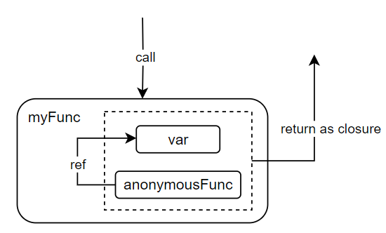

闭包：**一个函数与相关的引用环境组成的一个实体**，也就是说和函数所在的“上下文”关联。

匿名函数可以被视为闭包，通过闭包，我们可以将函数内外进行关联。

具体形式：在一个函数里面**嵌套一个匿名函数**，并将其**返回**。

**进一步理解：返回匿名函数，且这个匿名函数引用到了匿名函数外的 i 变量，这两者共同构成了“闭包”。**





:confused: vs?

- 全局变量：常驻内存，污染全局
- 局部变量：不常驻内存，不污染全局

:smile: **闭包可以实现常驻内存，且不污染全局**

```go
func getSeq() func() int { // return func() int
    i := 0                 // var i is kept in mem and it's local.
    return func() int {    // func() is anonymous
		i += 1
		return i
	}
}

nxt := getSeq()
fmt.Println(nxt()) // 1
fmt.Println(nxt()) // 2
fmt.Println(nxt()) // 3

nxtNew := getSeq()
fmt.Println(nxtNew()) // 1
fmt.Println(nxtNew()) // 2
fmt.Println(nxtNew()) // 3
```

### [Practice](https://zhuanlan.zhihu.com/p/92634505)