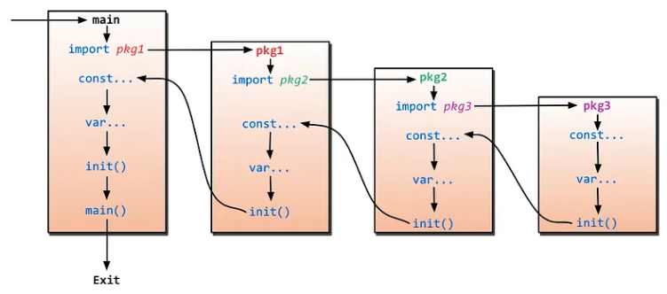

每一个 `*.go` 都可包含一个名为 init 函数，在 main 函数前执行；通常用于初始化。

顺序：**常量 → 全局变量** → init() → main()

```go
const pi = 3.14

var globalVar = genGlobalVar()

func genGlobalVar() int {
	fmt.Println("gen global var")
	return 1
}

func init() {
	fmt.Println("init")
}

func main() {
	fmt.Println("main")
}
```

