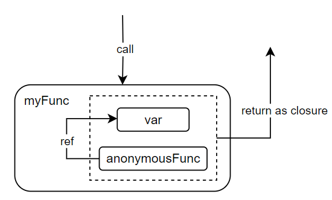

闭包：**一个函数与相关的引用环境组成的一个实体**，也就是说和函数所在的“上下文”关联。

具体形式：在一个函数里面**嵌套一个匿名函数**，并将其**返回**。

**进一步理解：返回匿名函数，且这个匿名函数引用到了匿名函数外的变量，这两者共同构成了“闭包”。**





**vs**

- 全局变量：常驻内存，污染全局。
- 局部变量：不常驻内存，不污染全局。

:smile: **闭包可以实现常驻内存，且不污染全局**。当我们把闭包传递给变量时，变量的值是一个地址；**每次赋值，变量是不同的地址。**

```go
func getSeq() func() int { // return func() int
    i := 0                 // var i is kept in mem and it's local.
    return func() int {    // func() is anonymous
		i += 1
		return i
	}
}

// type is func() int, value: 0x681a80
nxt := getSeq()
fmt.Println(nxt()) // 1
fmt.Println(nxt()) // 2
fmt.Println(nxt()) // 3

// type is func() int, value: 0x681b00
nxtNew := getSeq()
fmt.Println(nxtNew()) // 1
fmt.Println(nxtNew()) // 2
fmt.Println(nxtNew()) // 3
```

:bookmark_tabs: defer 配合匿名函数形成闭包，**改变函数的命名返回值**。

1. f() 调用，ret 初始零值 0。
2. return 前，defer 入栈不执行。
3. return 1 执行，赋值给 ret。
4. 执行 defer，ret++。
5. 返回 ret 值为 2.

```go
func f() (ret int) {
    defer func() {
        ret++
    }()
    return 1
}
func main() {
    fmt.Println(f())
}
```

**可见性 Scope**

当一个闭包中引用的变量都具有局部可见性，且其生命周期**与外部函数的生命周期相同**，那么闭包就形成了一个封闭的环境。

相反，如果闭包中**引用的变量具有全局可见性**或其生命周期超出外部函数的生命周期，闭包就不再是封闭的。

```go
func main() {
    x := 10

    closure := func() {
        fmt.Println("Closure value of x:", x)
    }

    closure() // 10

    x = 20

    closure() // 20
}
```

### [Practice](https://zhuanlan.zhihu.com/p/92634505)