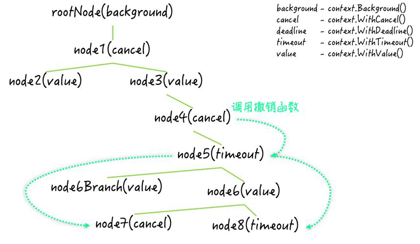
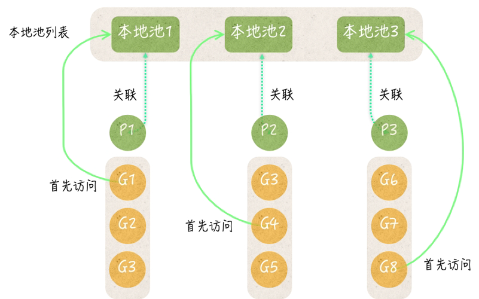
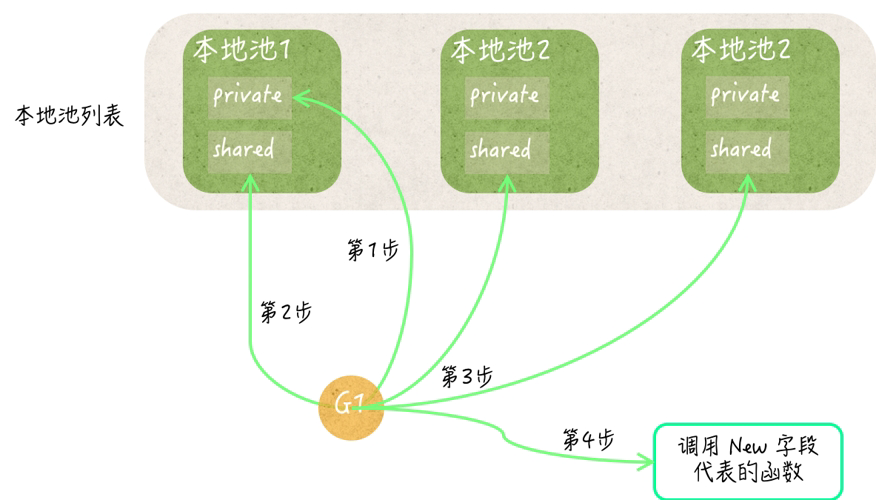

## [Sync](https://pkg.go.dev/sync)

> 临界资源 critical 被多个线程共享 → 竞争条件 Race Condition，进而破坏共享数据的一致性。

同步的目的：**避免**多线程同一时刻对同一资源进行操作；**协调**它们（应该以什么样的方式有序访问）。

Go **同步原语** sync primitives：

- `Mutex`：用于保护共享资源，以防止多个 goroutine 同时访问。
- `RWMutex`：允许多个读操作并发进行，但在写操作时会阻塞所有读和写操作。
- `Cond`：条件变量提供了一种机制，使得 goroutine 可以等待某些条件发生，并在条件发生时被通知。
- `Atomic`：提供原子操作，能完全屏蔽竞争条件且无法被中断。
- `WaitGroup`：用于等待一组 goroutine 完成工作。
- `Once`：确保某个操作只执行一次，适用于需要保证初始化只发生一次的场景。
- **`Channel`：用于 goroutine 之间的通信和同步，能够安全地传递数据和信号。**

### [Mutex](https://pkg.go.dev/sync#Mutex)

:construction_worker: 不要重复锁定互斥锁，否则会触发**死锁**；∵ 是**不可重入锁**，同一个 goroutine 持有情况下不能再次获取。

:construction_worker: 不要忘记解锁互斥锁，务必在上锁时使用 `defer` 确保最后解锁。

:construction_worker: 不要对尚未锁定或者已解锁的互斥锁解锁，否则 panic。

:construction_worker: 不要在多个函数之间直接传递互斥锁（传递副本），易死锁，不易维护。

```go
var mutex sync.Mutex

mutex.Lock()
// TODO
defer mutex.UnLock()
```

### [RWMutex](https://pkg.go.dev/sync#RWMutex)

读写锁是 Mutex 的一种扩展。

:construction_worker: 不能同时写；不能同时读写；只能同时读。

:construction_worker: 解锁未上锁，锁上未解锁都会触发 panic。

```go
var rwmutex sync.RWMutex

// read lock
rwmutex.RLock()
// TODO
defer rwmutex.RUnLock()

// write lock
rwmutex.Lock()
// TODO
defer rwmutex.UnLock()
```

### [Cond](https://pkg.go.dev/sync#Cond)

**条件变量**并不具备独立的锁机制，因此它需要一个已存在的互斥锁来进行操作。

不是被用来保护临界资源，主要用于**协调**。当共享资源发生变化时，它可被用来**通知**被互斥锁阻塞的线程。

- `Wait()` 使当前 goroutine **等待条件满足/等待对方通知**，需要先持有一个互斥锁。
- `Signal()` 唤醒**队头**等待条件变量的 goroutine。
- `Broadcast()` 唤醒**所有**等待条件变量的 goroutine。

```go
var mailbox uint8     // 0 empty, 1 full
var lock sync.RWMutex
sendCond := sync.NewCond(&lock)          // W lock as cond
recvCond := sync.NewCond(lock.RLocker()) // R lock as cond 
```

```go
// sender
lock.Lock()
for mailbox == 1 {   // if full
    sendCond.Wait()
}
mailbox = 1
lock.Unlock()
recvCond.Signal()  // wake up receiver
```

```go
// receiver
lock.RLock()
for mailbox == 0 {  // if empty
    recvCond.Wait()
}
mailbox = 0
lock.RUnlock()
sendCond.Signal()   // wake up sender
```

**:confused: 为什么要先锁才能调用 `Wait()` 呢？**

Wait() 主要做了四件事：

1. 将调用它的 goroutine 加入当前 cond 的**通知队列（队尾）**。
2. 解锁 cond 基于的互斥锁。
3. 阻塞 goroutine 使其等待通知
4. 通知来了唤醒并重新上锁。

∴ 提前上锁是为了 Wait() 种解锁，否则 panic。如果在未解锁的情况下阻塞，那么谁来解锁呢？

**:confused: 为什么使用 for？**

可能存在虚假唤醒，条件可能尚未满足，应该再次调用 wait 方法，∴ 需要反复检查。

### [Atomic](https://pkg.go.dev/sync/atomic)

Go 运行时为了确保公平会频繁进行 goroutine 的切换：运行时 ←→ 非运行时。

虽然互斥锁保证 goroutine 执行临界代码时不被干扰，但它仍可能被中断，进而破坏了操作的原子性。

**原子操作确保操作不会被中断。**

原子操作要求快速足够简单，否则会影响执行效率（毕竟不能被中断）。

**支持操作**：add, cas (compare & swap), load, store, swap

**支持数据类型**：int32、 int64、uint32、uint64、uintptr，unsafe.Pointer

```go
var counter int32 = 100
atomic.AddInt32(&counter, 1)
atomic.AddInt32(&counter, -1)

var value int32 = 42
if atomic.CompareAndSwapInt32(&value, 42, 100) {
    fmt.Println("Value was 42, changed to 100")
}

var value int32 = 42
loadedValue := atomic.LoadInt32(&value)

var value int32
atomic.StoreInt32(&value, 42)

var value int32 = 42
oldValue := atomic.SwapInt32(&value, 100)
```

**:confused: 为什么传入的是地址？**原子操作是**基于内存操作**，传入内存地址才可以进行精准操作。

**:confused: 读还需要原子嘛？**确保写完了才能读，类读写锁。

**:confused: cas vs. swap？**cas 由多个操作构成：比较/判等/交换，+for 可实现自旋锁，类互斥锁。

```go
for {
    if atomic.CompareAndSwapInt32(&num2, 10, 0) {
        fmt.Println("The second number has gone to zero.")
        break
    }
    time.Sleep(time.Millisecond * 500)
}
```

`atomic.value` 容器，以原子方式存储和加载**任意类型**的值。

属于结构体，赋值/传递会拷贝，修改不会改变原有的。

:construction_worker: ​不能存 nil，也不能时 interface{}，否则 panic。

:construction_worker: 存储的第一个值的类型，决定了之后存储值得类型，否则 panic。​

:construction_worker: 不要存引用类型​

```go
var value atomic.Value
value.Store(42)
// value.Store("42") // nok
value.Load()
value.Store("42")
// value.Store(42) // nok
value.Load()
```

```go
var box atomic.Value
v := []int{1, 2, 3}
box.Store(v)
v[1] = 4 // unsafe

store := func(v []int) {
    replica := make([]int, len(v))
    copy(replica, v)
    box.Store(replica) 
}
store(v)
v[2] = 5 // safe
```

### WaitGroup

并发安全，类计数器结构体。

**“统一 Add，再并发 Done，最后 Wait”**

- `Add()` 在主 goroutine 记录需要等待的 goroutine 的数量。
- `Done()` 在需要等待的 goroutine 中 defer 来减少计数器。
- `Wait()` 阻塞主 goroutine 等待所有 goroutine 完成任务再继续进行。

**:confused: 计数可以小于 0 嘛？** ダメ！否则 panic。要避免 `Add()` & `Wait()` 在不同 goroutine 中并发。

### Once

确保某个操作**只执行一次**，即使在多个 goroutine 中并发调用。

主要用于初始化操作，这些操作只应该被执行一次，以避免多次初始化带来的开销或错误。

`Do()` 接收一个**无参数无返回值的函数**，并确保这个函数只会被执行一次。

内置 done unit32 字段：记录函数被调用的次数，首次调用 0 → 1；因为要求**原子**操作，所以类型受限。

## [Context](https://pkg.go.dev/context)

上下文 [`context.Context`](https://draveness.me/golang/tree/context.Context) 用于在多个 goroutine 之间**传递信号/请求、超时和截止日期等信息**。

**目的：在多个 Goroutine 组成的树中同步取消信号以减少对资源的消耗和占用**

- `Deadline`：返回 [`context.Context`](https://draveness.me/golang/tree/context.Context) 完成工作的截止日期；
- `Done`：返回一个 chan，该 chan 会在当前工作**完成后**/上下文被**取消后关闭**，多次调用 `Done` 方法会返回同一个 chan；
- `Err`：返回 [`context.Context`](https://draveness.me/golang/tree/context.Context) 结束的原因，它只会在 `Done` 方法对应的 Channel 关闭时返回非空的值；
  - 如果 ctx 取消，返回 `Canceled` 错误；
  - 如果 ctx 超时，返回 `DeadlineExceeded` 错误；

- `Value`：从 [`context.Context`](https://draveness.me/golang/tree/context.Context) 中获取键对应的值，对同一个上下文，多次调用并传入相同的 `Key` 会返回相同的结果。

```go
type Context interface {
	Deadline() (deadline time.Time, ok bool)
	Done() <-chan struct{}
	Err() error
	Value(key interface{}) interface{}
}
```

### Background/TODO

[`context.Background`](https://draveness.me/golang/tree/context.Background) & [`context.TODO`](https://draveness.me/golang/tree/context.TODO) 都用于创建 context.Context 对象，可被 goroutine 复用。

- `background` ctx 的默认值，所有其他 ctx 都由其衍生。
- `todo` 仅在不确定应该使用哪种上下文时使用。


```go
ctx := context.Background()
ctx := context.TODO()
```

### Deadline

`context.WithDeadline()` 函数允许你从现有的上下文对象派生出一个新的上下文对象，并设置一个额外的截止时间。

```go
parentCtx := context.Background()
deadline := time.Now().Add(5 * time.Second)
ctx, cancel := context.WithDeadline(parentCtx, deadline)
```

### Timeout

`context.WithTimeout()` 和 `context.WithDeadline()` 类似，但不同的是它提供了一个持续相对时间（duration），而不是绝对的截止时间。

HTTP/PRC 往往启动树形结构的 goroutine，每个请求由一个单独的 goroutine 处理。

每一个 [`context.Context`](https://draveness.me/golang/tree/context.Context) 都会从顶层 Goroutine 依次传递至下层。如果上层有错误，可以及时**同步**到下层。


多个 goroutine 可以同时订阅 ctx.Done() 的超时分支，保证在同一时刻因出错而停止，实现**同步**。


```go
func main() {
	ctx, cancel := context.WithTimeout(context.Background(), 1*time.Second)
	defer cancel()

	go handle(ctx, 500*time.Millisecond)
    // go handle(ctx, 1500*time.Millisecond)
	select {
	case <-ctx.Done():
		fmt.Println("main", ctx.Err())
	}
}

func handle(ctx context.Context, duration time.Duration) {
	select {
	case <-ctx.Done():
		fmt.Println("handle", ctx.Err())
	case <-time.After(duration):
		fmt.Println("process request with", duration)
	}
}
```


### Cancel

[`context.WithCancel`](https://draveness.me/golang/tree/context.WithCancel) 能从 [`context.Context`](https://draveness.me/golang/tree/context.Context) 中衍生出一个新的子 ctxt & 返回用于取消该 ctxt 的函数 cancel。

一旦我们执行返回的取消函数，当前上下文以及它的子上下文都会被取消，所有的 goroutine 都会**同步**收到这一取消信号。

**如何理解撤销？**

一旦 ctxt 被撤销，接收通道就会被立即关闭，对于不包含任何值的通道，关闭会使其接收立刻结束。调用 `ctxt.Done()` 就会立刻感知。

```go
cancelCtx, cancel := context.WithCancel(context.Background())
go longRunningTask(cancelCtx)  // pass cancel ctx to goroutine
time.Sleep(3 * time.Second)
cancel()                       // cancel from main
```



### Value

[`context.WithValue`](https://draveness.me/golang/tree/context.WithValue) 能从父上下文中创建一个子上下文，传值给子上下文使用。

子上下文可通过 K，**类型断言**获取 V。

```go
withValCtx := context.WithValue(context.Background(), "K", "V")
value := ctx.Value("K");
```

## [Pool](https://pkg.go.dev/sync#Pool)

临时对象池，**并发安全**，它的值可以被用来存储**临时对象**，即不需要持续使用的某一类值，可有可无，创建/销毁 anytime。

UC：减少 GC，适合初始化开销大的对象；如果每个 goroutine 都实例化对象，这种非业务相关内存表那么对 GC 造成压力。

**初始化**（并没有申明大小哦！也就是说其中的元素个数是不确定的）

```go
bufferpool := &sync.Pool {
    New: func() interface {} {
        return struct{}{}
    }
}
```

`Get()` 获取已存在的对象，如果没有，则初始化。

`Put()` 将对象放回，但对象什么时候真正释放是不受外界控制的。

:construction_worker: 当用完一定要记得 Put 回去，否则无法复用，通常 defer。

```go
buffer := bufferPool.Get()
defer bufferPool.Put(buffer)
```

**为什么不适合 socket 或 DB 长连接？**

主要还是 ∵ 对 Pool 中的元素数量无法确定。

- Pool 池里的元素随时可能释放掉，释放策略完全由 runtime 内部管理。
- Get 获取到的元素对象可能是刚创建的，也可能是之前创建好 cache 住的，无法却分。

**临时对象什么时候销毁呢？**

在一个临时对象池的 Put 或 Get 第一次被调用的时候，这个池就会被添加到池汇总列表中。

池清理函数会遍历池汇总列表，对于其中的每一个临时对象池，它都会先将池中所有的**私有临时对象**和**共享临时对象**列表都置为 nil，然后再把这个池中的**所有本地池列表**都销毁掉。最后，池清理函数会把池汇总列表重置为空的切片。外部代码再无对它们的应用，在之后的 GC 就会被回收。

- 本地池列表长度同 P
- 每个本地池都包含
  - `private` 存储私有临时对象，只能被关联 P 队列中的 goroutine 访问。
  - `shared` 共享临时对象列表，可以被 goroutine 访问到（锁控制）。
  - `sync.Mutex`

一个运行中 goroutine 必然关联一个 P，会从本地池列表中获取一个本地池。**取哪个我们是无法控制 P 的行为的**。



Put 方法总会先试图把新的临时对象，存储到对应的本地池的 private 中。后续若发现 private 已有值，就会存到 shared。

Get 会先从 private 获取，若 nil，则会访问 shared，如果所有 share 都没有找到，就 New。

