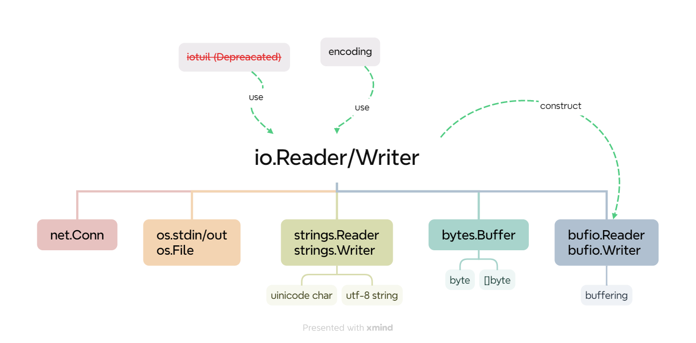

## Recap

Stream 流：可进行 IO 操作的内核对象；可以是一个 File/Pipeline/Socket。

流的入口：文件描述符 File Descriptor。

**输入流 Input(fromSrc)Stream & 输出流 Output(toDest)Stream**：通过输入流从文件中读取数据到程序中 vs. 程序通过输出流写入数据

注：流空读/流满写 → 阻塞 Blocking


## [io](https://pkg.go.dev/io)

提供 IO 原语的基础接口，很多接口围绕 [io.Reader](https://pkg.go.dev/io#Reader)/[io.Writer](https://pkg.go.dev/io#Writer) 展开：

- [net.Conn](https://pkg.go.dev/net#Conn)
- os.stdin, [os.File](https://pkg.go.dev/os#File)
- [strings.Reader](https://pkg.go.dev/strings#Reader)
- [strings.Builder](https://pkg.go.dev/strings#Builder)
- [bytes.Buffer](https://pkg.go.dev/bytes#Buffer)
- [bufio.Reader](https://pkg.go.dev/bufio#Reader)
- [bufio.Writer](https://pkg.go.dev/bufio#Writer)
- ~~[ioutil](https://pkg.go.dev/io/ioutil)~~
- [encoding](https://pkg.go.dev/encoding)

```go
// reads up to len(p) bytes into p, returns the number of bytes reads
type Reader interface {
	Read(p []byte) (n int, err error)
}

// writes len(p) bytes from p to the underlying data stream, returns the number of bytes writes
type Writer interface {
	Write(p []byte) (n int, err error)
}
```

### 

### net

[net.Conn](https://pkg.go.dev/net#Conn)

```go
type Conn interface {
    // Read reads data from the connection.
	// Read can be made to time out and return an error after a fixed
	// time limit; see SetDeadline and SetReadDeadline.
	Read(b []byte) (n int, err error)

	// Write writes data to the connection.
	// Write can be made to time out and return an error after a fixed
	// time limit; see SetDeadline and SetWriteDeadline.
	Write(b []byte) (n int, err error)
}
```

### OS

[os.File](https://pkg.go.dev/os#File)

It represents an open **file descriptor**

```go
func Create(name string) (*File, error)                 // creates or truncates the named file
func CreateTemp(dir, pattern string) (*File, error)     // creates a new temp file in the directory dir
func NewFile(fd uintptr, name string) *File             // returns a new File with the given fd and name
func Open(name string) (*File, error)                   // opens the named file for reading

// generalized open call
// If the file does not exist, and the O_CREATE flag is passed
// If successful, methods on the returned File can be used for I/O
func OpenFile(name string, flag int, perm FileMode) (*File, error) 
```

```go
func (f *File) Chdir() error              // changes the current working directory to the file
func (f *File) Chmod(mode FileMode) error // changes the mode of the file to mode
func (f *File) Chown(uid, gid int) error  // changes the numeric uid and gid of the named file
func (f *File) Close() error              // closes the File, rendering it unusable for I/O
func (f *File) Fd() uintptr               // returns the integer Unix file descriptor referencing the open file
func (f *File) Name() string              // returns the name of the file

// reads len(b) bytes from the File and stores them in b
func (f *File) Read(b []byte) (n int, err error)
// reads len(b) bytes starting from offset
func (f *File) ReadAt(b []byte, off int64) (n int, err error)
// reads the contents of the directory associated with the file
// returns a slice of DirEntry values in directory order
func (f *File) ReadDir(n int) ([]DirEntry, error)
// implements io.ReaderFrom
func (f *File) ReadFrom(r io.Reader) (n int64, err error)
// reads the contents of the directory associated with file
// returns a slice of up to n FileInfo values
func (f *File) Readdir(n int) ([]FileInfo, error)
// reads the contents of the directory associated with file 
// returns a slice of up to n names of files in the directory
func (f *File) Readdirnames(n int) (names []string, err error)

// sets the offset for the next Read or Write on file to offset
func (f *File) Seek(offset int64, whence int) (ret int64, err error)


func (f *File) SetDeadline(t time.Time) error      // sets the read and write deadlines for a File
func (f *File) SetReadDeadline(t time.Time) error  // sets the deadline for future Read calls
func (f *File) SetWriteDeadline(t time.Time) error // sets the deadline for any future Write calls

func (f *File) Stat() (FileInfo, error)                // returns the FileInfo structure describing file
func (f *File) Sync() error                            // commits the current contents of the file to stable storage
func (f *File) SyscallConn() (syscall.RawConn, error)  // returns a raw file
func (f *File) Truncate(size int64) error              // changes the size of the file given size

func (f *File) Write(b []byte) (n int, err error)              // writes len(b) bytes from b to the File
func (f *File) WriteAt(b []byte, off int64) (n int, err error) // writes len(b) bytes from offset
func (f *File) WriteString(s string) (n int, err error)        // writes the contents of string instead of []byte
func (f *File) WriteTo(w io.Writer) (n int64, err error)       // implements io.WriterTo
```

os.Std*

```go
var (
	Stdin  = NewFile(uintptr(syscall.Stdin), "/dev/stdin")
	Stdout = NewFile(uintptr(syscall.Stdout), "/dev/stdout")
	Stderr = NewFile(uintptr(syscall.Stderr), "/dev/stderr")
)
```

### strings

> 面向 Unicode 字符 & UTF-8 编码的字符串

[strings.Builder](https://pkg.go.dev/strings#Builder)

高效拼接字符串，减少内存拷贝，可重置内容。内置 []byte 在拼接过程中会自动扩容，对应一个底层数组。

非并发安全，需要同步原语实现并发安全。

```go
type Builder struct {
	addr *Builder // of receiver, to detect copies by value
	buf  []byte
}
```

```go
func (b *Builder) Cap() int　　　  // capacity　　　　　　　　
func (b *Builder) Grow(n int)　　  // preallocate, panic if grow again
func (b *Builder) Len() int       // length
func (b *Builder) Reset()         // clear
func (b *Builder) String() string // to string

func (b *Builder) Write(p []byte) (int, error)       
func (b *Builder) WriteByte(c byte) error             
func (b *Builder) WriteRune(r rune) (int, error)      
func (b *Builder) WriteString(s string) (int, error)  
```

[strings.Reader](https://pkg.go.dev/strings#Reader)

高效读取字符串，读取过程中保存已读取的字节计数。下一次读取即可从断点处开始。

```go
func (r *Reader) Len() int
func (r *Reader) Read(b []byte) (n int, err error)              // reads to buf, return numbers of bytes read
func (r *Reader) ReadAt(b []byte, off int64) (n int, err error) // reads to buf from offset, returns number of bytes read
func (r *Reader) ReadByte() (byte, error)                       // reads one byte
func (r *Reader) ReadRune() (ch rune, size int, err error)      // reads one rune
func (r *Reader) Reset(s string)                                // reset offset
func (r *Reader) Seek(offset int64, whence int) (int64, error)  // reads from whence (0 head/1 curr/2 tail) given offset
func (r *Reader) Size() int64                                   // avail number of bytes for reading 

func (r *Reader) UnreadByte() error                             // puts one byte read back to reader
func (r *Reader) UnreadRune() error                             // puts one rune read back to reader
func (r *Reader) WriteTo(w io.Writer) (n int64, err error)      // write to io.Writer, returns total number of byte written
```

### bytes

> 面向字节 & 切片

[bytes.Buffer](https://pkg.go.dev/bytes#Buffer)

```go
type Buffer struct {
	buf      []byte // contents are the bytes buf[off : len(buf)]
	off      int    // read at &buf[off], write at &buf[len(buf)]
	lastRead readOp // last read operation, so that Unread* can work correctly.
}
```

```go
func (b *Buffer) Available() int             // number of bytes unused in buffer
func (b *Buffer) AvailableBuffer() []byte    // returns an empty buffer with b.Available() capacity
func (b *Buffer) Bytes() []byte              // returns a slice of length b.Len() holding the unread portion of the buffer. 
func (b *Buffer) Cap() int                   // returns the capacity of the buffer's underlying byte slice
func (b *Buffer) Grow(n int)                 // preallocate
func (b *Buffer) Len() int                   // number of bytes of the unread portion of the buffer
func (b *Buffer) Next(n int) []byte          // returns a slice containing the next n bytes from the buffer

func (b *Buffer) Read(p []byte) (n int, err error)               // reads the next len(p) bytes from the buffer
func (b *Buffer) ReadByte() (byte, error)                        // reads and returns the next byte from the buffer
func (b *Buffer) ReadBytes(delim byte) (line []byte, err error)  // reads until the first occurrence of delim in the input
func (b *Buffer) ReadFrom(r io.Reader) (n int64, err error)      // reads data from io.Reader, returns number of bytes read
func (b *Buffer) ReadRune() (r rune, size int, err error)        // reads one rune & returns
func (b *Buffer) ReadString(delim byte) (line string, err error) // reads until the first occurrence of delim in the input

func (b *Buffer) Reset()              // resets the buffer to be empty
func (b *Buffer) String() string      // to string
func (b *Buffer) Truncate(n int)      // discards all but the first n unread bytes from the buffer
func (b *Buffer) UnreadByte() error   // unreads the last byte
func (b *Buffer) UnreadRune() error   // unreads the last rune

func (b *Buffer) Write(p []byte) (n int, err error)        // appends the contents of p to the buffer
func (b *Buffer) WriteByte(c byte) error                   // appends the byte c to the buffer
func (b *Buffer) WriteRune(r rune) (n int, err error)      // appends the rune r to the buffer
func (b *Buffer) WriteString(s string) (n int, err error)  // appends the contents of s to the buffer
func (b *Buffer) WriteTo(w io.Writer) (n int64, err error) // writes data to io.Writer
```

### bufio

> IO 内置了 Buffer 提高性能（内存+异步），减少系统调用

[bufio.ReadWriter](https://pkg.go.dev/bufio#ReadWriter)

```go
type ReadWriter struct {
	*Reader
	*Writer
}
```

[bufio.Reader](https://pkg.go.dev/bufio#Reader)

注：需要 `io.Reader` 进行构造。

```go
func NewReader(rd io.Reader) *Reader               // default buffer size 4KB
func NewReaderSize(rd io.Reader, size int) *Reader // specify buffer size
```

```go
func (b *Reader) Buffered() int                            // returns the number of bytes that can be read in current buffer
func (b *Reader) Discard(n int) (discarded int, err error) // skips the next n bytes, returning the number of bytes discarded
func (b *Reader) Peek(n int) ([]byte, error)               // returns the next n bytes without advancing the reader

func (b *Reader) Read(p []byte) (n int, err error)         // reads data into p
func (b *Reader) ReadByte() (byte, error)                  // reads and returns a single byte
func (b *Reader) ReadBytes(delim byte) ([]byte, error)     // reads until the first occurrence of delim in the input

func (b *Reader) ReadLine() (line []byte, isPrefix bool, err error) // low-level line-reading primitive
func (b *Reader) ReadRune() (r rune, size int, err error)           // reads a single rune
func (b *Reader) ReadSlice(delim byte) (line []byte, err error)     // reads until the first occurrence of delim in the input
func (b *Reader) ReadString(delim byte) (string, error)             // reads until the first occurrence of delim in the input

func (b *Reader) Reset(r io.Reader)                        // discards any buffered data
func (b *Reader) Size() int                                // returns the size of the underlying buffer in bytes
func (b *Reader) UnreadByte() error                        // unread the last byte
func (b *Reader) UnreadRune() error                        // unread the last rune
func (b *Reader) WriteTo(w io.Writer) (n int64, err error) // write to io.Writer
```

[bufio.Writer](https://pkg.go.dev/bufio#Writer)

注：需要 `io.Writer` 进行构造。

```go
func NewWriter(w io.Writer) *Writer                // default buffer size 4KB
func NewWriterSize(w io.Writer, size int) *Writer  // specify buffer size
```

```go
func (b *Writer) Available() int              // returns how many bytes are unused in the buffer
func (b *Writer) AvailableBuffer() []byte     // returns an empty buffer with b.Available() capacity
func (b *Writer) Buffered() int               // returns the number of bytes written into the current buffer

func (b *Writer) Flush() error                               // writes any buffered data to the underlying io.Writer
func (b *Writer) ReadFrom(r io.Reader) (n int64, err error)  // reads data from r until EOF
func (b *Writer) Reset(w io.Writer)                          // discards any unflushed buffered data
func (b *Writer) Size() int                                  // size of the underlying buffer in bytes

func (b *Writer) Write(p []byte) (nn int, err error)     // writes content of p into the buffer
func (b *Writer) WriteByte(c byte) error                 // writes a single byte
func (b *Writer) WriteRune(r rune) (size int, err error) // writes a single rune
func (b *Writer) WriteString(s string) (int, error)      // writes a string
```

### ~~[ioutil](https://pkg.go.dev/io/ioutil)~~

**Deprecated**: As of Go 1.16, the same functionality is now provided by package [io](https://pkg.go.dev/io) or package [os](https://pkg.go.dev/os)

### [encoding](https://pkg.go.dev/encoding)

Convert data to/from byte-level & textual repr.

- [base64](https://pkg.go.dev/encoding/base64@go1.23.0)
- [binary](https://pkg.go.dev/encoding/binary@go1.23.0)
- [csv](https://pkg.go.dev/encoding/csv@go1.23.0)
- [gob](https://pkg.go.dev/encoding/gob@go1.23.0)
- [hex](https://pkg.go.dev/encoding/hex@go1.23.0)
- [json](https://pkg.go.dev/encoding/json@go1.23.0)
- [pem](https://pkg.go.dev/encoding/pem@go1.23.0)
- [xml](https://pkg.go.dev/encoding/xml@go1.23.0)

```go
// marshal into bin
type BinaryMarshaler interface {
	MarshalBinary() (data []byte, err error)
}

// unmarshal from bin
type BinaryUnmarshaler interface {
	UnmarshalBinary(data []byte) error
}

// marshal to textual
type TextMarshaler interface {
	MarshalText() (text []byte, err error)
}

// unmarshal from textual
type TextUnmarshaler interface {
	UnmarshalText(text []byte) error
}
```

## Best Practice

1. 使用 defer 关闭文件，避免资源泄露。使用闭包捕捉 file 变量，确保 close() 仍然可以访问到。

```go
defer func(file *os.File) {
	err := file.Close()
	if err != nil {
        panic(err)
	}
}(file)
```

2. 在文件操作过程中始终检查错误并处理。
3. 使用 `os.OpenFile` 打开创建文件（显式指定模式和权限）。
4. 对于小文件，使用 `os.ReadFile` 直接一口气读取到内存 → []byte。
5. 对于大文件，使用 `bufio.Reader/Writer`，构造时可指定 buffer 大小。逐行读取：`bufio.ReadLine("\n")`
6. 写文件结束后一定要记得 flush。
7. 注意并发控制。