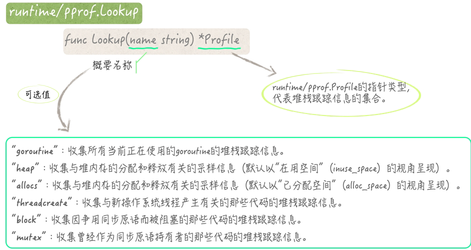

Profile: CPU, Mem, Block (阻塞)。

### stdlib

- `runtime/pprof` 提供了 CPU 和内存等性能分析的功能。它可以生成程序运行时的性能分析报告。
  - CPU profiling 频率未暴露，默认 100Hz。
  - Mem 默认 512KB，即每 malloc 512KB 就采样一次。`runtime.MemProfileRate(KB)`
  - Block 只要发现一个阻塞事件的持续时间达到了多少 ns，就可以对其进行采样。`runtime.SetBlockProfileRate(ns)`
- `net/http/pprof` 提供了基于 HTTP 的性能分析接口。它集成了 `runtime/pprof` 提供的性能分析功能，并通过 HTTP 接口公开这些功能。
  - http://localhost:6060
    - `/debug/pprof/`: 入口页面
    - `/debug/pprof/profile`: CPU profile，默认 30 秒
    - `/debug/pprof/heap`: 内存 profile
    - `/debug/pprof/goroutine`: Goroutine profile
    - `/debug/pprof/block`: 阻塞 profile
    - `/debug/pprof/threadcreate`: 线程创建 profile
- `runtime/trace` 提供了更细粒度的程序执行跟踪功能。它可以生成一个完整的程序执行跟踪报告，包括 Goroutine 执行、系统调用、网络事件等。
- `runtime/pprof.Lookup` 用于查找和获取特定类型的 profile。



### Tool

`go tool pprof -http=:port` 交互式解析生成的 pprof 文件。

- `top`：显示 CPU 使用最多的函数
- `list <function>`：显示特定函数的详细信息
- `web`：生成图形化报告并在浏览器中打开
- `png`：生成图形化报告并保存为 PNG 文件

```bash
# required for web & png
$ sudo apt-get install graphviz gv
```

`go tool trace` 可打开生成的 trace 文件。

