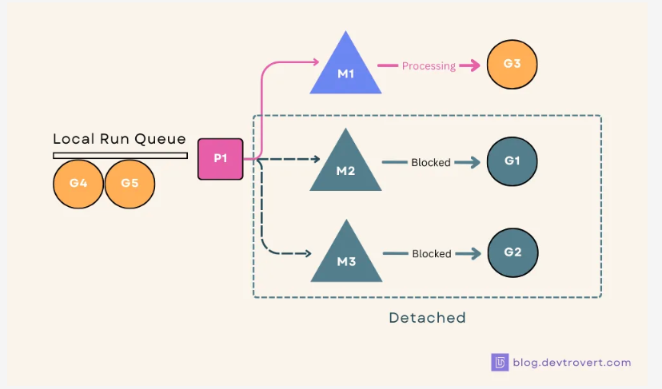
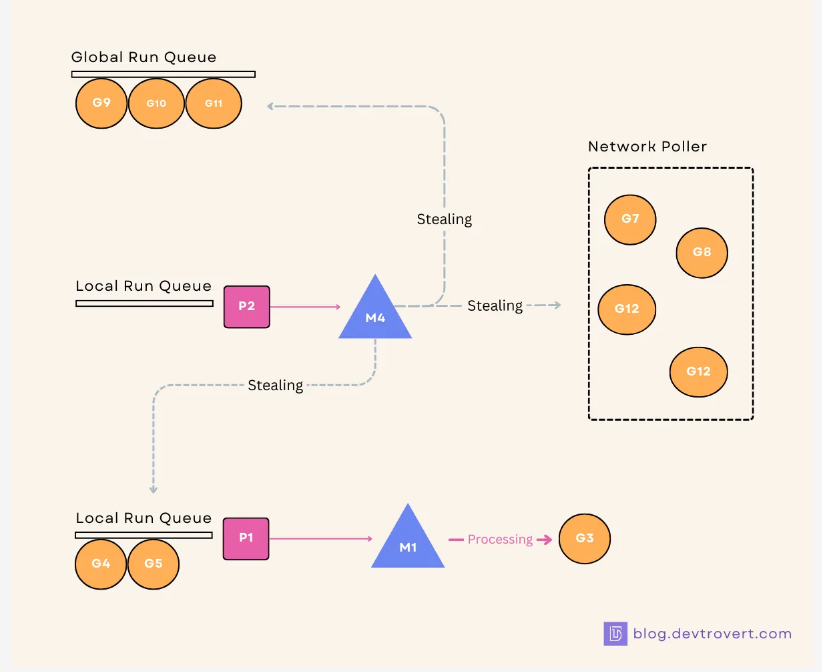

Go 协程 goroutine 最小的执行单元，由主线程创建分支，属于逻辑态，轻量相比于线程有**更小的开销**；

挂载 Go 主线程下拥有**独立的栈空间（自伸缩，不用担心溢出），共享堆空间，LCM 由 Go runtime 调度/管理**。

```go
go func_to_call()
```

### [Basic Walkthrough](https://blog.devtrovert.com/p/goroutines-think-you-know-go-basics)

**vs**

- Java: Thread & ExecutorService frameworks.
- Python: Threading tied up with Global Interpreter Lock (GIL).
- **Go: keyword `go` it just works!**

```go
func main() {
  go doSomething()
  // ++ otherwise, main exit before goroutine finished.
  time.Sleep(time.Second)  
  fmt.Println("done")
}

func doSomething() {
  fmt.Println("doSomething called")
}
```


**Over OS threads**

- **Size**: 2KB only

- **Creation**: faster & eaiser

- **Schedule**: m:n strategy by Go runtime.

- **Ctxt switch**: faster

- **Identity**: no ID

- **Comm**: channel instead of mutex/semaphore/conditional var

  

**CPU cores**

`GOMAXPROCS` 可控制运行时可并行的 goroutine 的最大数量。**带缓冲通道**也可以控制并发执行 goroutine，其他则被阻塞。

```go
fmt.Println(runtime.NumCPU())      // 12
fmt.Println(runtime.GOMAXPROCS(0)) // 12 where 0 takes full advantages of
```

```go
// since v1.5
func init() {
    runtime.GOMAXPROCS(4)
}
```

```bash
# ENV
$ GOMAXPROCS=4 go run your_program.go
```

**按既定顺序执行 goroutine**

```go
// 将 i 作为变量传入，确保每个 goroutine 拿到唯一的整数
// 传入的值会先求值
for i := 0; i < 10; i++ {
	go func(i uint32) {
		fn := func() {    // 先声明了一个匿名的函数，并把它赋给了变量 fn，并打印当前的 i
			fmt.Println(i)
		}
	trigger(i, fn) // 将 i & fn 传入 trigger 函数
	}(i)
}

// 让 count 变量成为一个信号，它的值总是下一个可以调用打印函数的 go 函数的序号
var count uint32

trigger := func(i uint32, fn func()) {
	// 不断地获取一个名叫 count 的变量的值，并判断该值是否于 i 相同，相同则执行传入的匿名函数，否则自旋。
    // 使用原子操作，避免多 goroutine 并发竞争
    // 只有匹配的 count 的 goroutine 才会执行，然后 count++
    for {
		if n := atomic.LoadUint32(&count); n == i {
			fn()
			atomic.AddUint32(&count, 1)
			break
		}
        // spinning if cond not met
		time.Sleep(time.Nanosecond)
	}
}
```

### [Scheduler](https://blog.devtrovert.com/p/goroutine-scheduler-revealed-youll)

Goroutines * `M` → via **Scheduler** → Kernel Threads * `N` → `GOMAXPROCS`

- 就执行速度来说，Goroutines 并没有比 OS thread 快，∵ 本身就需要 OS thread 来运行。
- **其真正的优势在于：线程切换开销小，内存占用小，创建/销毁成本低。**

#### MPG Model

**G = Goroutine**，一旦创建，就会被置于 P 的队列中，由 P 交由 M 执行。

- Waiting：paused by channel/local or syscall.
- Runnable: waiting to be executed on M.
- Running: executing on M.

:bookmark_tabs: 当初始化一个 Goroutine 时，如果池中没有才会新创建，否则直接从池中获取。


**P = (Logical) Processor** → `GOMAXPROCS` 默认同系统 CPU 核数 = 可并行执行的 Goroutine 数量。

每一个 P 都有一个**本地队列**存放待执行的 Goroutine，最多 256。如果队列满了，Goroutine 进**全局队列**。


**M = Machine Thread = OS/Kernal Thread** 从 P 中获取 G 并执行。

```go
// set max kernel threads can execute
runtime/debug.SetMaxThreads()
```

#### Flow

1. go func() 运行时创建一个新的 goroutine 或从池中获取。
2. goroutine 进入 P 的本地队列；若队列已满，则进全局队列。
3. M 尝试从 P 中本地队列取出 G，此时 P 被当前 M 占有。
4. 当 M 选定 G 后，就分配资源使其运行。


如果 G 发起一个系统调用，阻塞很长的时间，M 就会进入等待 Wait。

此时 P 会和处于等待的 M **解除绑定**，并寻找新的 M 继续执行队列中的 G。



#### Stealing

1. 每 61 ticks，M 会检查全局队列，找到了就执行，确保处于全局队列中的 G 不会被饿死 → 公平性。
2. 若没找到，则会寻找绑定 P 中的本地队列。
3. 若队列已空，则会再次寻找全局队列执行。
4. 若还没有找到，则从 Network Poll 中寻找。
5. 若还没有扎到，会进入自旋，主动搜索模式。
6. 该模式下，M 会从其他 P 中的本地队列中获取一半的 G



Network Poller 负责处理异步网络 I/O，封装 epoll 能够高效处理并发网络连接。

1. 当一个 Goroutine 发起一个网络 I/O 操作（例如读或写）时，如果操作不能立即完成，网络轮询器将接管该操作。
2. 轮询器会将 I/O 操作注册到操作系统的 I/O 多路复用机制上，并将当前 Goroutine 置于等待状态。
3. 一旦操作系统检测到 I/O 操作完成，轮询器会将相应的事件通知 Goroutine 调度器，后者会恢复相应的 Goroutine 继续执行。