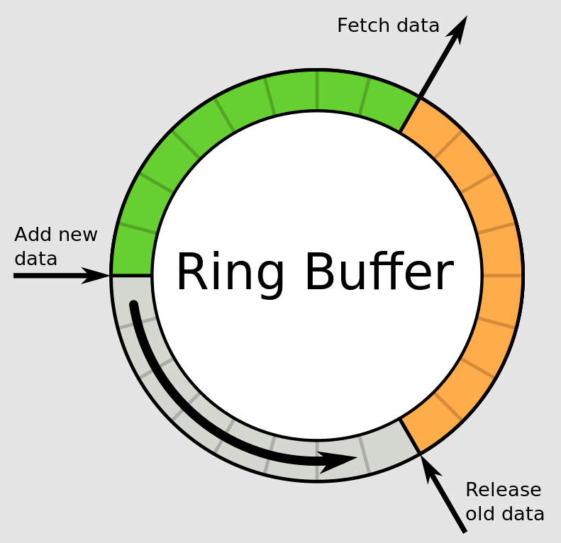

> **不要通过共享内存来通信，要通过通信来共享内存**
> 
> Don’t communicate by sharing memory; share memory by communicating.

:confused: **不同协程间如何通信？**

- 全局变量加锁
- **Channel** ≈ pipe-like 以一种安全的方式，实现协程间的同步。管道 Channel 属于**引用类型**。同 slice/map，需要通过 make 进行初始化。（未初始化值为 nil）
  - 发送 = 复制元素值 + 副本进通道
  - 接收 = 复制通道内副本 + 复制副本到接收 + 删除通道内副本

```go
newChan := make(chan int[, buf])

// len <= cap
len(newChan)
cap(newChan)
```

```go
// send
intChan := make(chan int, 3)
intChan <- 10

// recv
n := <-intChan
// drop
<-intChan 
```

可以创建一个**空接口管道**，可以存放任何类型的变量

```go
allChan := make(chan inerface{}, 10)
```

**关闭**：对已关闭管道发送会 panic，持续接收最终会返回管道类型的 zero-value。

1. 由发送端主动关闭
2. ok 模式检测是否关闭
3. 在 for 循环中，break if nok → 直接使用 for-range 自动检测关闭

```go
intChan := make(chan int, 3)
intChan <- 1
intChan <- 2
close(intChan) // disable push only
a := <-intChan // can still pop
close(intChan) // panic

if v, ok := <-ch; ok {
    // TODO
}
```

```go
for {
    v, ok := <-ch
    if !ok {
        break
    }
}

// better
for v := range ch {
    // TODO
}
```

**遍历**：只能使用 for-range 遍历，因为 chan 的长度是变化的。

```go
intChan := make(chan int, 10)
for i := 0; i < 10; i++ {
    intChan <- i
}
close(intChan) // must close before iter

for v := range intChan {
    fmt.Println(v)
}
```

**容器迭代器**：容器类型的 Iter() 方法，**返回一个只读管道。函数内构建管道并将元素都塞进去**。外部调用通过 for-range 取。

```go
func (c *container) Iter () <- chan items {
    ch := make(chan item)
    go func () {
        for i:= 0; i < c.Len(); i++{    // or use a for-range loop
            ch <- c.items[i]
        }
        close(ch)
    } ()
    return ch
}

for x := range container.Iter() { ... }
```

**类型**

- **Unbufferred**：无缓冲，即没有指定 cap；发送和接收是同步的。
  - 发送会立刻阻塞管道，直到接收。
  - 接收会立刻阻塞管道，直到发送。
  - UC：立即阻塞，强制同步协作。
- **Buffered**：缓冲，指定 cap；管道未满/未空不会阻塞。
  - 缓冲满则阻塞发送
  - 缓冲空会阻塞接收 
  - UC：（不同速率）生产消费。
- **Send-only**
  - UC：限制生产者只能生产，传递给函数时限制其只能发送。
- **Receive-only**
  - UC：限制消费者只能消费，传递给函数时限制其只能接收。

```go
var sendCh chan<- int = make(chan int)
func producer(sendCh chan<- int) {}

var recvCh <-chan int = make(chan int)
func consumer(recvCh <-chan int) {}
```

空管道 nil：会无限阻塞发送/接收，如果尝试关闭会 panic。

- UC：结合 select 占位符确保不执行任何实际操作，分支永远不会执行。

```go
var nilCh chan type
close(nilCh) // panic

select {
case val := <-ch1:
    fmt.Println("Received value:", val)
case val := <-ch2:
    fmt.Println("Received value:", val)
case <-emptyChan:
    fmt.Println("This will never be printed")
}
```

### Internal

Ring Buffer 环形缓冲/循环队列，对于多用户读写，必须要添加**互斥**保持以保证并发访问时安全的。

- R *ptr 读指针：指向环形缓冲区中**有效数据开始**的位置 Head。

- W *ptr 写指针：指向环形缓冲区中**有效数据结束**的位置 Tail。

- 读写指针指向同一位置，则缓冲区空；写指针位于读指针的相邻后一个位置，则缓冲区满。

  




**Essense of Channel** → Ring Buffer + Sendq & Recvq

```go
type hchan struct {
    qcount   uint           // 队列中元素的数量
    dataqsiz uint           // 环形队列的大小
    buf      unsafe.Pointer // 指向环形队列的指针
    elemsize uint16         // 每个元素的大小
    closed   uint32         // 通道是否已关闭
    sendx    uint           // 环形队列中的发送索引
    recvx    uint           // 环形队列中的接收索引
    recvq    waitq          // 等待接收的 Goroutine 队列
    sendq    waitq          // 等待发送的 Goroutine 队列
    lock     mutex          // 互斥锁，保护 channel 的操作
}

type waitq struct {
    first *sudog // 阻塞的第一个 Goroutine
    last  *sudog // 阻塞的最后一个 Goroutine
}
```
